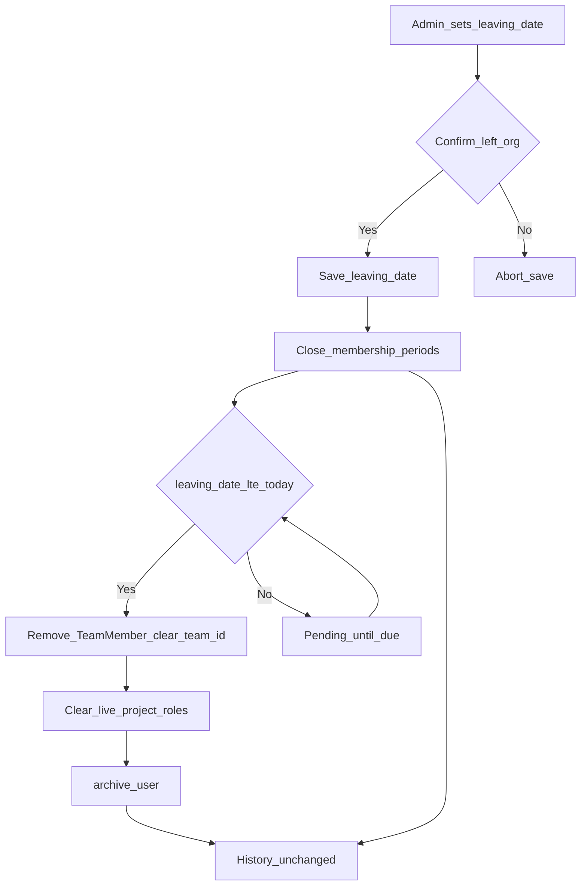
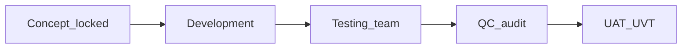

# RC5 — Last working day confirm → soft offboard (history retained)

**Status:** Implemented — awaiting Testing → QC → UAT/UVT  
**Date:** 2026-08-01  
**Stakeholders:** Head of HR · Head of Operations · Finance (existing last-day rules)

## 1. Problem

Setting **Last working day** (`users.leaving_date`) already drives salary / billable-headcount proration, but did not ask the admin to confirm the person has left, and did not remove them from live teams. Ops still saw leavers on the org chart and team rosters after their last day.

## 2. Stakeholder brainstorm (locked)

| Seat | Concern | Locked outcome |
|------|---------|----------------|
| **Head of HR** | Confirm intentional exit; never erase tenure, teams, projects, timesheets, reviews, exit paperwork | Confirm dialog before persist; soft offboard only; history tables untouched |
| **Head of Operations** | Org chart / capacity / active teams must not show leavers after last day; mid-notice people still work until then | End live team membership **on/after** last working day; close membership periods to that date; archive login |
| **Finance (existing RC5)** | Salary & billable N already honor `users.leaving_date` | Keep using `leaving_date`; offboard must not break proration ([RC5_FINANCE_MANAGEMENT_TEAM_LAST_DAY.md](./RC5_FINANCE_MANAGEMENT_TEAM_LAST_DAY.md)) |

### Product rules

```text
1. Admin sets/changes Last working day → modal:
   "Confirm this employee has left / is leaving the organisation?"
   Yes → save date + run offboard pipeline
   No / Cancel → do not save the new leaving_date

2. Soft offboard (never hard-delete history):
   - Close open TeamMembershipPeriod rows: effective_to = leaving_date
   - When leaving_date <= today (or when due): remove live TeamMember rows,
     clear User.team_id, archive user (is_archived + is_active=false)
   - Clear live project role slots (design_leader / designer / surfacer) with audit
   - Preserve: timesheets, activities, membership periods, salary profiles,
     lifecycle events, exit interviews, performance history

3. Future-dated last day:
   - Confirm + save leaving_date now
   - Close periods to that date (finance-correct)
   - Defer live team removal + archive until leaving_date is reached
     (apply_due_offboards on API startup and roster/user list refresh)

4. Clearing leaving_date later does NOT auto-restore teams or un-archive
   (use existing Restore archive + Move resource)

5. Exit Process module stays optional HR paperwork — not required to trigger offboard

6. Server enforces confirm_left_organisation=true when leaving_date is newly set or changed
```



## 3. Where to develop

| Layer | Path | Work |
|-------|------|------|
| Direction | `docs/RC5_EMPLOYEE_LAST_DAY_OFFBOARD.md` | This doc |
| Phase | `app/db/phase67_employee_offboard_schema_sync.py` | `users.offboard_applied_at` |
| Service | `app/services/employee_offboard_service.py` | Confirm + close periods + due apply |
| Lifecycle | `app/services/user_lifecycle_service.py` | Archive without forced double-commit |
| API | `app/api/v1/users.py`, `app/api/v1/finance.py` | Require confirm flag; call service |
| Schemas | `app/schemas/identity.py`, `app/schemas/finance.py` | `confirm_left_organisation` |
| UI | `UsersPage.tsx`, `FinancePeopleCostsPanel.tsx` | ConfirmDialog before save |
| Tests | `tests/test_employee_offboard.py` | Confirm, due/deferred, history |
| Startup | `app/main.py` | Register phase67 + `apply_due_offboards` |

## 4. Pipeline (mandatory)



### Testing team matrix

- [ ] Confirm **Cancel** does not change `leaving_date` or teams
- [ ] Confirm **Yes** + past/today date: removed from Teams UI & org chart; archived; login inactive; history still queryable
- [ ] Confirm **Yes** + future date: still on team until date; salary factor still leaving-aware; after due-pass (restart or list refresh), removed + archived
- [ ] Finance P&L / CPR / billable N unchanged vs existing last-day rules
- [ ] Project role slots cleared; timesheet history intact
- [ ] API rejects set/change of `leaving_date` without `confirm_left_organisation: true` (422)
- [ ] Clearing `leaving_date` does not un-archive or rejoin team
- [ ] Restore archive does not silently rejoin old team (ops must Move resource)
- [ ] Idempotent: re-saving same leaving_date / re-running due-pass does not error or wipe history

### QC audit gates

- [ ] No hard deletes of user / timesheet / membership-period / activity rows
- [ ] Confirm flag enforced **server-side** (not UI-only)
- [ ] Idempotent offboard; no double-close period bugs
- [ ] Permissions: only Admin (users) / finance edit (roster) can trigger
- [ ] `offboard_applied_at` set exactly once when live offboard runs

### Pre-UAT / UVT ops

1. Restart **backend** after phase67 schema sync  
2. `npm run build` in `frontend/` then hard-refresh browser  
3. Staging fixtures: one past-dated leaver + one future-dated leaver  
4. Walk Testing matrix → QC sign-off → UAT/UVT

## 5. Out of scope (this release)

- Auto-creating Exit Interview records  
- Auto-restore / undo offboard from clearing the date  
- Hard delete of users  
- Reassigning timesheet entries to other people  

## Related

- [RC5_FINANCE_MANAGEMENT_TEAM_LAST_DAY.md](./RC5_FINANCE_MANAGEMENT_TEAM_LAST_DAY.md)  
- [RC5_FINANCE_TEAM_TRANSFER_EFFECTIVE.md](./RC5_FINANCE_TEAM_TRANSFER_EFFECTIVE.md)  
- [RC5_EXIT_INTERVIEW_OFFBOARD.md](./RC5_EXIT_INTERVIEW_OFFBOARD.md)  
- HR UI: **Past employees** at `/hr/past-employees` (sidebar under Human Resources)  
