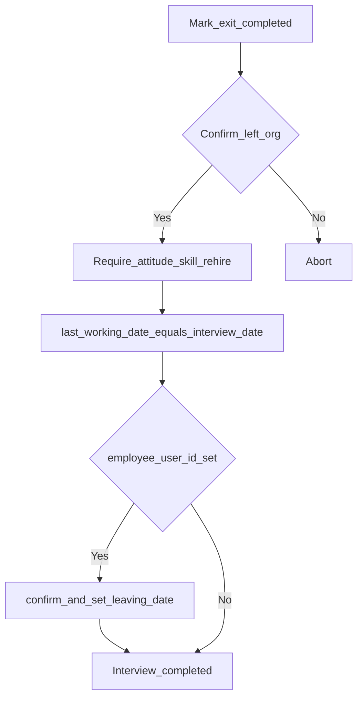
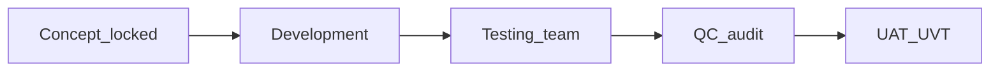

# RC5 — Exit interview → last working day + soft offboard + TA assessment

**Status:** Implemented — awaiting Testing → QC → UAT/UVT  
**Date:** 2026-08-01  
**Stakeholders:** Head of Talent Acquisition · Head of HR · Head of Operations  
**Depends on:** [RC5_EMPLOYEE_LAST_DAY_OFFBOARD.md](./RC5_EMPLOYEE_LAST_DAY_OFFBOARD.md)

## 1. Problem

Exit interviews (PP-HRD-FO-30) could be completed without setting employment last day or soft-offboarding the linked user. Talent Acquisition also lacked structured interviewer fields for attitude, skillset, and rehire eligibility.

## 2. Stakeholder brainstorm (locked)

| Seat | Concern | Locked outcome |
|------|---------|----------------|
| **Head of Talent Acquisition** | Rehire pipeline needs clear flags; skill/attitude captured at exit | Required on complete: attitude was good (Y/N), skillset rating 1–5, eligible for rehire (Yes / No / Conditional) |
| **Head of HR** | Completing an interview must not silently offboard; intentional leave confirm | Confirm dialog before complete; server requires `confirm_left_organisation` when completing |
| **Head of Operations** | Interview conduct date is the operational last day unless HR already set LWD earlier; remove from live teams after that day | On complete: `last_working_date` = `interview_date` when interview date is set; then call existing soft-offboard pipeline for linked `employee_user_id` |

### Product rules

```text
1. Mark exit interview Completed → confirm:
   "Confirm this employee has left / is leaving the organisation?"
   Cancel → do not complete / do not offboard
   Yes → complete + sync LWD + soft offboard (if linked user)

2. Interview date → Last working day:
   When completing, if interview_date is set → last_working_date := interview_date
   Else keep existing last_working_date (must be present to complete when linked user)

3. Soft offboard reuses employee_offboard_service.confirm_and_set_leaving_date
   (periods closed, due remove/archive, history retained)

4. HR assessment (interviewer, required on complete):
   - attitude_was_good: true | false
   - skillset_rating: 1..5
   - eligible_for_rehire: yes | no | conditional

5. Manual-name interviews (no employee_user_id): still require confirm + assessment;
   no user offboard (nothing to remove from teams)

6. Draft / in_progress saves do not offboard
```



## 3. Where to develop

| Layer | Path | Work |
|-------|------|------|
| Direction | `docs/RC5_EXIT_INTERVIEW_OFFBOARD.md` | This doc |
| Phase | `app/db/phase68_exit_interview_assessment_schema_sync.py` | Assessment columns |
| Model / schemas | `ExitInterview`, `exit_process` schemas | Fields + confirm flag |
| Service | `exit_process_service.update_exit_interview` | Complete → sync LWD + offboard |
| API | `app/api/v1/exit_process.py` | Pass actor + confirm |
| UI | `ExitProcessPage.tsx` | Assessment fields + ConfirmDialog |
| Tests | `tests/test_exit_process.py` (+ offboard cases) | Confirm, sync, fields |

## 4. Pipeline



### Testing matrix

- [ ] Cancel complete confirm → status stays draft/in_progress; no leaving_date change
- [ ] Complete with interview_date → last_working_date equals interview_date
- [ ] Linked employee + complete + confirm → soft offboard (team remove when due, archive, history kept)
- [ ] Complete without confirm flag → 422
- [ ] Complete without attitude / skillset / rehire → 422
- [ ] Unlinked (manual name) complete → interview completes; no user mutation
- [ ] Assessment fields visible/saved on form and list detail
- [ ] Finance last-day proration still honors `users.leaving_date`

### QC gates

- [ ] Confirm enforced server-side on complete
- [ ] No hard deletes of history
- [ ] Offboard idempotent via existing `offboard_applied_at`
- [ ] Assessment required only on transition to `completed`

### Pre-UAT ops

Restart API after phase68; rebuild frontend; hard-refresh. Fixture: linked employee with interview today + one future interview date.

## Out of scope

- Auto-create exit interviews from Users leaving_date  
- TA dashboard filters on rehire (follow-up)  
- Changing completed interviews to reopen and undo offboard  
