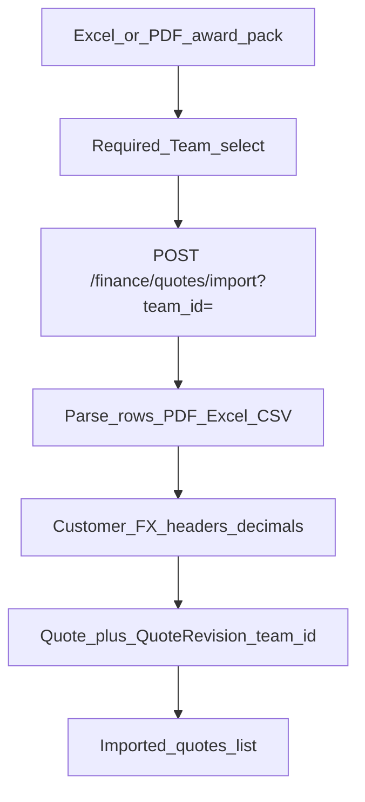

# RC5 — Awarded project quote import (team-scoped PDF / Excel)

## Problem (UAT)

1. **Revenue / quotes → Upload Quote File** fails with a generic **“Quote import failed”** toast; the real API reason is often hidden.
2. There is **no team picker on the import itself**. Page-level Team filter exists for Overview / costs, but quote upload does not bind awarded projects to a delivery team.
3. Imports are for **awarded projects only** (won work) — Finance needs team attribution so Overview / planning revenue can be team-sliced later.
4. Upload must keep supporting **Excel (.xlsx / .xlsm)** and **PDF (table layout)** (CSV remains allowed as a fallback).

---

## HOD lock (do not reopen in build)

| Decision | Lock |
|----------|------|
| Scope of this import | **Awarded** quotes only (won work). UI copy must say so. Not a bid pipeline / estimate workspace. |
| Team on import | **Required.** Operator selects **Team** before upload (or confirms the page Team filter when one team is selected). **All teams** is not a valid upload target. |
| Formats | **Excel** `.xlsx` / `.xlsm`, **PDF** text table, **CSV**. Reject legacy `.xls` with an actionable message. |
| Customer match | Row **Customer** must match an existing active customer **name or code**. Do not auto-create customers on import (v1). |
| Currency | Row **Currency** if present; else customer `default_currency_code`; else INR. Convert to base INR at write via existing FX rules ([RC5_FINANCE_CUSTOMER_CURRENCY_FX.md](./RC5_FINANCE_CUSTOMER_CURRENCY_FX.md)). FX must exist **on or before** quote start date / import date. |
| Tool / project link | Match `tool_number` to an existing non-deleted `projects.tool_number` when possible; store `quotes.project_id`. Missing project is allowed (quote still imports) but list UI should flag **Unlinked**. |
| Team storage | Persist `quotes.team_id` (new column). Revision rows inherit team via quote. Import must set / update team on create and on new revision. |
| Overview revenue (v1 follow-on) | Keep company-level quote rollup; **add** team-scoped planning signal using `quotes.team_id` when Team filter is set (see Implementation Notes). Do not invent per-row “share” math in this slice. |
| Errors | Surface **exact** API `detail` in the toast (row number + reason). Never only “Quote import failed”. |
| Partial import | **All-or-nothing** per file (current behaviour): one bad row → 400, nothing committed. |

---

## Product intent

Operators receive award packs (Excel from commercial / PDF extract from customer or sales). They import those into Financial Planning so:

- Quoted hours / cost / revenue land in finance base (INR snapshot).
- Each batch is tagged to the **delivery team** (e.g. Sybridge-LS, Prosohm Eng).
- Later Overview under that team can show awarded revenue signal without dumping every company quote into every team lens.

---

## Current state (as-of code)

| Area | Today | Gap |
|------|--------|-----|
| UI | `FinanceDashboardPage` tab **Revenue / quotes** — upload only | No team required on upload; weak error toast |
| API | `POST /api/v1/finance/quotes/import` (multipart `file`) | No `team_id` Form/Query param |
| Service | [`quote_import_service.py`](../app/services/finance/quote_import_service.py) — Excel / PDF / CSV | No team; customer must pre-exist; FX on start date |
| Model | [`Quote`](../app/models/finance.py) — customer, optional project, currency, revisions | **No `team_id`** |
| List | `GET /finance/quotes` — all active quotes | No team filter; thin card UI |
| Overview | Quote revenue summed company-wide | Not attributed to team |

Common real failure causes behind the red toast (fix visibility first):

1. **Customer not found** — name/code not exact match to Admin → Customers.
2. **No FX rate** for row currency on/before Start Date (same class of bug as team commercial FY start).
3. **PDF not a machine table** — scanned image / no header row / different column titles.
4. **Wrong headers** — missing Customer / Tool Number.
5. **Duplicate version-revision** for same tool.
6. Legacy **.xls**.

---

## Click map (target UX)

| What | Where |
|------|--------|
| Page team filter | Financial Planning top bar (existing) — when a single team is selected, pre-fill import team |
| Import team (required) | **Revenue / quotes** → **Team for this upload** Select above **Upload Quote File** |
| Formats helper | Short list + link/text: required columns; “Awarded projects only” |
| Upload | Excel / PDF / CSV |
| Result list | Tool · customer · team · currency · rev · linked/unlinked · revenue snapshot |
| Errors | Toast with full `detail` (e.g. `Row 4: Customer not found: ACME GmbH`) |

**Required columns (Excel / CSV / PDF header row):**

| Column | Required | Notes |
|--------|----------|-------|
| Customer | Yes | Existing customer name or code |
| Tool Number | Yes | Awarded tool / project identity |
| Quoted Hours | Yes* | Treat blank as 0 only if product agrees; prefer required |
| Estimated Cost | Yes* | Same |
| Quoted Revenue | Yes* | Same |
| Currency | No | Default customer currency → INR |
| Business Model | No | Match working model name/code |
| Start Date / End Date | No | Drives FX `on_date`; prefer award / start date |
| Version / Revision | No | Default 1 / A |
| Margin | No | Else revenue − cost |

\*Lock in Dev: blank numeric → `0` (current) **or** reject row — Senior Tester must confirm sample files.

---

## Implementation notes (Development)

### Backend

1. **Schema** — `phase28_quote_team_schema_sync.py` (name OK):
   - `quotes.team_id` UUID NULL → backfill optional; **new imports require non-null**.
   - Index `(team_id)`, FK → `teams.id`.
2. **Schemas** — `QuoteRead.team_id`, optional `team_name`; import result unchanged + optional `warnings: list[str]` for unlinked tools (v1 can skip warnings).
3. **API** — `POST /finance/quotes/import`:
   - Accept `team_id: UUID = Form(...)` (or Query).
   - 400 if team missing / inactive.
   - Pass into `import_quotes_from_upload(..., team_id=...)`.
4. **`import_quote_row`** — set `quote.team_id = team_id` on create; on revise, **update** `team_id` to the upload team (last award team wins — lock this).
5. **Currency default** — if currency cell empty, use `customer.default_currency_code`.
6. **`GET /finance/quotes?team_id=`** — filter when provided; page uses selected import/list team.
7. **Dashboard (minimal)** — when `team_id` query present, `customer_revenue` / planning quote signal = sum of latest revision `base_quoted_revenue_inr` for quotes with that `team_id` (define “latest” = max version/revision or current quote pointer). Company “All” keeps full sum.
8. **Errors** — keep raising `ProTrackValidationError` with row index; ensure HTTP 400 `detail` is a **string**.

### Frontend

1. Extract `FinanceQuotesPanel.tsx` (optional but preferred) from `FinanceDashboardPage`.
2. Required **Team** Select (reuse teams lookup / `FinanceTeamFilter` pattern). Disable Upload until team chosen.
3. `FormData`: `file` + `team_id`.
4. Use `apiErrorMessage` helper so toasts show real failures.
5. Copy: “Import **awarded** project quotes for the selected team. PDF must be a text table with a header row.”

### Tests

- Excel import with `team_id` → quote.team_id set.
- PDF happy path (monkeypatch table extract) with team.
- Missing team → 400.
- Unknown customer → 400 with row text.
- USD + start_date before mid-year seed → succeeds after FX backfill ([phase27](../app/db/phase27_fx_rate_backfill.py)).
- List `?team_id=` isolation.
- Designer / no finance create → 403.

### Out of scope (this package)

- Creating projects from quotes.
- Bid vs award status workflow on `Quote`.
- OCR for scanned PDFs.
- Editing quote cards (follow-up; mirror expense CRUD if needed).
- Changing Historical timesheet importers.

---

## Pipeline

1. **Development** — implement locks above; unit/API tests green.  
2. **Senior Tester** — verify against matrix with sample Excel + PDF; gate to Testing.  
3. **Testing** — debug failures (customer seed, FX, PDF layout); log repros.  
4. **Senior Tester** — re-approve after fixes.  
5. **QC expert** — audit docs ↔ UI ↔ API; checklist below.  
6. **UAT** — Finance operators on staging with real award packs.

### Senior Tester / Testing matrix

- [ ] Without team selected → Upload disabled or 400; never silent company dump.
- [ ] Excel `.xlsx` awarded pack → N quotes; each shows correct team.
- [ ] PDF table (same columns) → same.
- [ ] CSV still works.
- [ ] `.xls` → clear reject message.
- [ ] Customer typo → toast shows `Row X: Customer not found: …`.
- [ ] Missing FX for currency/date → toast shows FX message; after Budgets & reports FX entry (or seed), retry succeeds.
- [ ] Duplicate version-revision → actionable toast.
- [ ] Team A import invisible under quotes filter Team B; visible under A / All.
- [ ] Overview Team A shows awarded quote INR signal for A only (All = company).
- [ ] Unlinked tool (no project) still imports; UI marks Unlinked.
- [ ] Non-finance role cannot import.
- [ ] Regression: Expenses / Team commercial edit; FX panel; retainer USD + FY start.

### QC audit

- [ ] UI states **awarded** only; team required; Excel+PDF called out.
- [ ] `docs/RC5_FINANCE_AWARDED_QUOTE_IMPORT.md` matches shipped behaviour.
- [ ] Deploy `app/` + `frontend/dist`; restart API so phase28 (+ phase27 FX) run.
- [ ] No secret/sample customer data left in repo fixtures beyond tests.
- [ ] Confirm Overview team filter does not double-count fee + quotes incorrectly.

---

## Likely immediate unblock (before full team feature)

If UAT only needs “upload works” today:

1. Ensure customers in the file exist under **Admin → Customers** (exact name/code).
2. Ensure FX rate exists for currency **on or before** Start Date (**Budgets & reports → FX rates**, or rely on phase27 early seed).
3. Prefer `.xlsx` with the header names above; PDF must be selectable text table, not a scan.
4. Rebuild frontend so toast shows API `detail` (not only “Quote import failed”).

Full **team-on-import** still follows this doc before UAT sign-off of Finance Rebuild awards flow.

---

## Related

- Team lens: [RC5_FINANCE_TEAM_SCOPE.md](./RC5_FINANCE_TEAM_SCOPE.md)
- Customer currency + FX immutability: [RC5_FINANCE_CUSTOMER_CURRENCY_FX.md](./RC5_FINANCE_CUSTOMER_CURRENCY_FX.md)
- Editable fee models / project-based revenue from quotes: [RC5_FINANCE_EDITABLE_FEE_MODELS.md](./RC5_FINANCE_EDITABLE_FEE_MODELS.md)
- Code: [`app/services/finance/quote_import_service.py`](../app/services/finance/quote_import_service.py), [`app/api/v1/finance.py`](../app/api/v1/finance.py) (`/quotes/import`), [`frontend/src/pages/FinanceDashboardPage.tsx`](../frontend/src/pages/FinanceDashboardPage.tsx) (Revenue / quotes tab)
