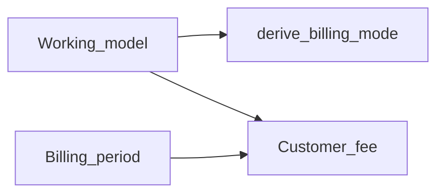
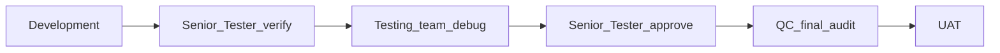

# RC5 — Team Commercial UX (Working Model vs Billing) + Expense Edit/Delete

## Context from UAT feedback

On **Team commercial**, users see both **Working model** and **Billing mode** (e.g. “Project Based (Fixed Fee)” + “Subscription”) — confusing and often contradictory. Separately, **Expenses & subscriptions** still has create + list only; edit/delete was specified earlier but **not shipped** yet.

This doc is the single gate for Development → Senior Tester → Testing → Senior Tester → QC → UAT.

---

## Part A — Working model vs Billing mode

### Verdict (HOD lock)

**They should not both be free-choice UI fields.** Keep one commercial intent; derive the other.

| Concept | What it is | Keep? |
|---------|------------|--------|
| **Working model** | Ops catalog row (`working_models`: Project Based, T&M, Retainer, Overheads). Links finance to how the team already works and to finance KPI strategies. | **Yes — primary field** |
| **Billing mode** | Finance enum on `team_commercial_terms` (`fixed_price`, `subscription`, `time_materials`, `project_based`). Parallel vocabulary; overlaps Working Model and causes invalid combos (Project Based + Subscription). | **No as a separate user choice** — store derived value for API/compat |
| **Period** | Monthly / quarterly / annual / one-time — *when* the fee recurs. | **Yes — keep separate** (this is not “billing mode”) |

### Derivation lock (Working model → billing_mode)

| Working model `strategy_key` | Stored `billing_mode` | Period default (UI hint only) |
|------------------------------|------------------------|-------------------------------|
| `project_based` | `project_based` | `one_time` (user may override) |
| `time_materials` | `time_materials` | `monthly` |
| `retainer` | `subscription` | `monthly` |
| `overheads` | `fixed_price` | `monthly` |

- API may still accept `billing_mode` for backward compatibility; if omitted, server sets from working model.
- UI: **remove Billing mode dropdown**; show helper text under Working model: “Fee cadence is set by Period (monthly / …).”
- List cards: show **Working model name** + period + fee; do not duplicate billing_mode label unless debugging.

### Where to develop (Part A)

| Area | Files |
|------|--------|
| UI | [`FinanceTeamCommercialPanel.tsx`](../frontend/src/components/finance/FinanceTeamCommercialPanel.tsx) — drop Billing mode select; on model change set period hint + omit billing_mode or send derived |
| API | [`app/api/v1/finance.py`](../app/api/v1/finance.py) create/update team-commercial — if `billing_mode` missing, map from `WorkingModel.strategy_key` |
| Schemas | [`TeamCommercialTermsCreate`](../app/schemas/finance.py) — `billing_mode` optional |
| Docs | Helper copy on Team commercial panel |

---

## Part B — Expense edit & soft-delete (must ship)

Full detail remains in [RC5_FINANCE_EXPENSE_CRUD.md](./RC5_FINANCE_EXPENSE_CRUD.md). **Status: direction complete; implementation still pending** (matches current UI).

### HOD lock (summary)

| Decision | Lock |
|----------|------|
| Edit | `PATCH /finance/expenses/{id}` — same fields as create, in-panel Edit → Save changes |
| Delete | Soft-delete `is_active=false` + ConfirmDialog (name · amount · team · paid by) |
| Permissions | EDIT for patch/delete; Designer 403 |
| Out of scope | Hard delete; restore browser |

### Where to develop (Part B)

| Area | Files |
|------|--------|
| API | [`app/api/v1/finance.py`](../app/api/v1/finance.py) — PATCH + DELETE |
| Schemas | `ExpenseUpdate` in [`app/schemas/finance.py`](../app/schemas/finance.py) |
| UI | [`FinanceExpensesPanel.tsx`](../frontend/src/components/finance/FinanceExpensesPanel.tsx) + [`ConfirmDialog`](../frontend/src/components/common/ConfirmDialog.tsx) |
| Tests | [`tests/test_ebmp_finance.py`](../tests/test_ebmp_finance.py) |
| Deploy | Rebuild `frontend/dist` |

---

## Recommended delivery slice (one Dev package)

Ship **both** in one RC5 increment so UAT is not blocked twice:

1. Team commercial: hide Billing mode; derive server-side.
2. Expenses: Edit + soft-Delete.

Purchase-date / FY cutover ([RC5_FINANCE_PURCHASE_DATE_FY.md](./RC5_FINANCE_PURCHASE_DATE_FY.md)) stays a **separate** follow-on unless HOD pulls it into the same sprint.

## Pipeline (mandatory)

1. **Development** — Part A + Part B; deploy `app/` + `frontend/dist`; restart API.
2. **Senior Tester verify** — matrix below; sign checklist.
3. **Testing team** — debug / regression; log defects.
4. **Senior Tester approve** — blockers cleared.
5. **QC** — no contradictory Working model vs Billing labels; soft-delete only; Overview updates on edit/delete; docs match UI.
6. **UAT** — Head of Finance: set Retainer team (no billing mode field); edit a license amount; delete a cancelled line.

### Senior Tester / Testing matrix

**Team commercial**

- [ ] Billing mode dropdown **gone**; Working model + Period + fee remain
- [ ] Save Retainer → stored billing_mode = `subscription`; fee on Overview
- [ ] Save Project Based → billing_mode = `project_based`
- [ ] Existing terms list still readable

**Expenses**

- [ ] Edit amount → Overview rollup updates
- [ ] Edit team A → B → filters correct
- [ ] Delete → confirm → gone from list; Overview ↓; renewals ignore
- [ ] Edit/delete inactive → 404
- [ ] Designer 403 on PATCH/DELETE

**Regression**

- [ ] Who-pays defaults; team filter; salary exempt; renewals notify

## Related

- [RC5_FINANCE_EXPENSE_CRUD.md](./RC5_FINANCE_EXPENSE_CRUD.md)
- [RC5_FINANCE_TEAM_SCOPE.md](./RC5_FINANCE_TEAM_SCOPE.md)
- [RC5_FINANCE_PURCHASE_DATE_FY.md](./RC5_FINANCE_PURCHASE_DATE_FY.md)
- [RC5_FINANCE_REBUILD.md](./RC5_FINANCE_REBUILD.md)
