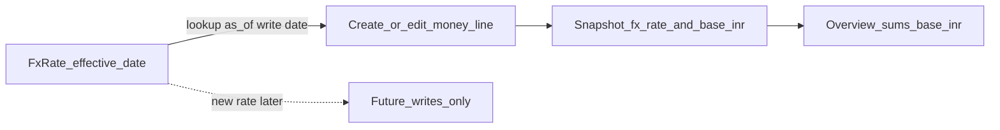

# RC5 — Customer currency, immutable FX history & editable Finance lists

## Problem (UAT)

1. Customers operate in **multiple countries** — need a **default currency per customer**.
2. Finance must be able to **enter FX rates** (currency → company base, usually INR).
3. When FX is updated later, **prior months / prior saved amounts must not change** (point-in-time posting).
4. Expenses, team commercial terms, and other Financial Planning lists are still **not editable / deletable** in the UI (confirmed on Expenses & Team commercial screens).

---

## HOD lock (do not reopen in build)

### 1 — Customer currency

| Decision | Lock |
|----------|------|
| Field | `customers.default_currency_code` (`CHAR(3)`, FK-style to `currencies.code`, default **INR**) |
| UI | Admin → **Customers** create/edit: **Default currency** dropdown (from `/finance/currencies` or shared currencies list) |
| Behaviour | New **quotes** (and quote import when currency omitted) default to customer currency. Expenses / team fees stay on their own `currency_code` but UI may suggest customer currency when a project/customer context exists later. |
| Change later | Changing customer default currency does **not** rewrite historical quote/expense `base_*_inr` rows. |

### 2 — FX rates (enter + effective dating)

| Decision | Lock |
|----------|------|
| Storage | Existing [`FxRate`](../app/models/finance.py): `from_currency`, `to_currency`, `rate`, `effective_date` |
| UI | Financial Planning → **Budgets & reports** (or a sub-panel **FX rates**): list recent rates + form **From / To / Rate / Effective date** → `POST /finance/fx-rates` (API already exists) |
| Lookup | [`resolve_fx_rate`](../app/services/finance/fx_service.py): rate with latest `effective_date <= as_of_date` |
| To currency | Always company **base currency** (INR unless settings say otherwise) |
| Edit past rates | **Do not overwrite** historical rate rows used by postings. New rate = **new row** with new `effective_date`. Optional: block PATCH of rates that have `effective_date` in a closed month (v1: **no update API**; create-only). |

### 3 — Immutable prior calculations (critical)

| Decision | Lock |
|----------|------|
| Posting rule | On **create/update of a money line** (expense, salary profile, team fee, quote revision, budget), convert once via `to_base_amount(..., on_date=…)`, persist **`amount` + `currency_code` + `fx_rate` + `fx_date` + `base_*_inr`**. |
| Overview / P&L | **Always sum stored `base_*_inr`**. Never live-reconvert historical rows with today’s FX. |
| FX rate table change | Affects **only** conversions on or after that `effective_date` for **new writes**. Rows with `fx_date` before the new rate stay unchanged. |
| Editing an expense amount today | Recompute base using FX as of the expense’s **purchase/fx date** (or today if new); still does not change *other* months’ rows. |
| Month close (v1) | Soft rule: document that Finance should not mass-edit old months; no hard GL lock engine in this slice. |

### 4 — Editable Financial Planning (must ship with this package)

Bundled so UAT is not blocked again. Full matrices in sibling docs; this package **requires**:

| List | Edit | Delete |
|------|------|--------|
| Expenses & subscriptions | Yes (`PATCH`) | Soft-delete |
| Team commercial cards | Yes (`PUT` exists) | Soft-delete (`DELETE` exists) |
| People costs | Already inline save | N/A (profiles upsert) |
| Budgets | Status approve exists; name/amount edit optional later | Out of scope v1 |

Also apply fee-model locks from [RC5_FINANCE_EDITABLE_FEE_MODELS.md](./RC5_FINANCE_EDITABLE_FEE_MODELS.md) (retainer = per resource/month; project-based = no flat customer fee) when shipping Team commercial edit.

---

## Where to develop

### Backend

| Work | Files |
|------|--------|
| Customer currency column + sync | `phase26` (or phase27) schema sync; [`Customer`](../app/models/models.py); [`organization` schemas](../app/schemas/organization.py); customers API |
| Seed currencies | Ensure USD/EUR/GBP/INR (and others as needed) in `currencies` |
| FX create-only policy | [`finance.py`](../app/api/v1/finance.py) — no PATCH for fx-rates in v1; document |
| Snapshots | Verify expense/quote/team/salary paths always write `base_*` + `fx_rate`; **never** batch job that rewrites old bases |
| Quote default currency | [`quote_import_service`](../app/services/finance/quote_import_service.py) + quote create if any |
| Expense/Team CRUD | [RC5_FINANCE_EXPENSE_CRUD.md](./RC5_FINANCE_EXPENSE_CRUD.md) + [RC5_FINANCE_EDITABLE_FEE_MODELS.md](./RC5_FINANCE_EDITABLE_FEE_MODELS.md) |

### Frontend

| Work | Files |
|------|--------|
| Customer currency | [`CustomersPage.tsx`](../frontend/src/pages/admin/CustomersPage.tsx) |
| FX rates panel | New section on Finance Dashboard **Budgets & reports** tab (or Overview settings strip) |
| Expense Edit/Delete | [`FinanceExpensesPanel.tsx`](../frontend/src/components/finance/FinanceExpensesPanel.tsx) |
| Team commercial Edit/Delete + fee rules | [`FinanceTeamCommercialPanel.tsx`](../frontend/src/components/finance/FinanceTeamCommercialPanel.tsx) |
| Deploy | Rebuild `frontend/dist` |

### Tests

- Customer create with `USD`; quote without currency picks USD.
- Post expense in USD on date D with rate R1 → `base_amount_inr` fixed; insert rate R2 effective D+1 → dashboard still uses old base for that expense.
- New expense after R2 uses R2.
- Expense PATCH/DELETE; team commercial PUT/DELETE.
- Designer 403 on FX create and finance mutations.

---

## Click map

| What | Where |
|------|--------|
| Customer currency | Admin → Customers → Default currency |
| Enter FX rate | `/finance` → Budgets & reports → FX rates |
| Edit/delete expense | Expenses & subscriptions → row actions |
| Edit/delete team terms | Team commercial → card actions |

---

## Pipeline (mandatory)

1. **Development** — lock above; deploy `app/` + `frontend/dist`; restart API.
2. **Senior Tester verify** — matrix; sign checklist.
3. **Testing team** — debug / regression.
4. **Senior Tester approve** — blockers cleared.
5. **QC** — historical bases immutable; FX UI create-only; customer currency; all finance lists editable as locked; docs match UI.
6. **UAT** — Head of Finance: set customer USD; enter EUR→INR rate; post expense; change rate next month; confirm prior month INR total unchanged; edit/delete expense and team terms.

### Senior Tester / Testing matrix

- [ ] Customer default currency save/load
- [ ] FX rate create with effective date; list shows newest
- [ ] Historical expense INR unchanged after later FX update
- [ ] New posting uses new rate
- [ ] Expense Edit + Delete works
- [ ] Team commercial Edit + Delete works
- [ ] No live re-FX of Overview from rate table alone
- [ ] Designer 403
- [ ] Rebuild 2 / who-pays / salary-exempt regressions

### Explicit non-goals

Live market FX feeds; multi-base books; rewriting all quotes when customer currency changes; hard GL period lock; hard-delete.

## Related

- [RC5_FINANCE_EDITABLE_FEE_MODELS.md](./RC5_FINANCE_EDITABLE_FEE_MODELS.md)
- [RC5_FINANCE_EXPENSE_CRUD.md](./RC5_FINANCE_EXPENSE_CRUD.md)
- [RC5_FINANCE_COMMERCIAL_UX_EXPENSE_CRUD.md](./RC5_FINANCE_COMMERCIAL_UX_EXPENSE_CRUD.md)
- [RC5_FINANCE_TEAM_SCOPE.md](./RC5_FINANCE_TEAM_SCOPE.md)
- [RC5_FINANCE_REBUILD.md](./RC5_FINANCE_REBUILD.md)
