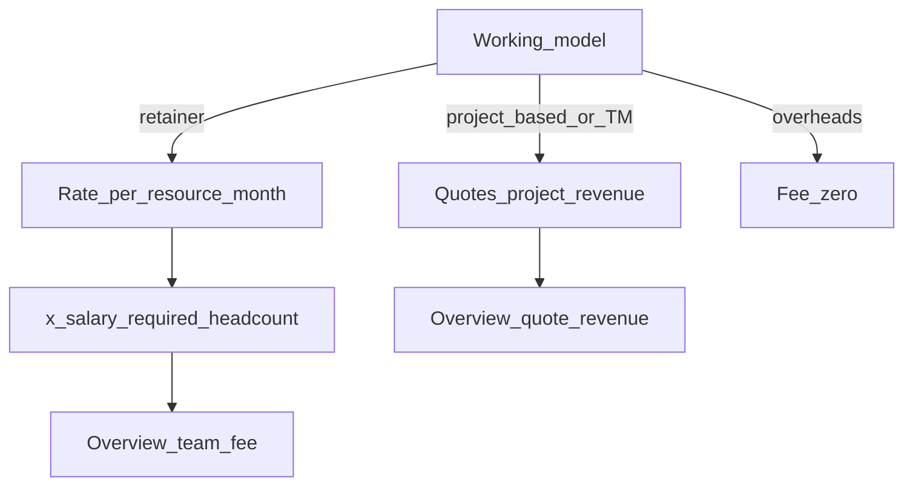

# RC5 — Editable Expenses & Team Commercial + Model Fee Rules

## Problem (from UAT screens)

1. **Expenses & subscriptions** list (e.g. NX Mold 1) and **Team commercial** cards (e.g. Prosohm Eng / Sybridge-Sale) are **display-only** — no Edit / Delete.
2. **Retainer / Subscription**: customer pay is not a single flat fee; it is **per resource per month**.
3. **Project Based (Fixed Fee)** teams: do **not** ask “how much the customer pays” on Team commercial — commercial revenue comes from **quotes on completed / quoted projects**, not a team flat fee.

API note: `PUT` / `DELETE` for team-commercial already exist in [`app/api/v1/finance.py`](../app/api/v1/finance.py); Expenses still need `PATCH` / soft-`DELETE`. UI must expose both.

---

## HOD lock (do not reopen in build)

### A — Edit / Delete everywhere these lists appear

| Surface | Edit | Delete |
|---------|------|--------|
| Expenses list | Load row into form → **Save changes** (`PATCH`) | Confirm → soft-delete `is_active=false` |
| Team commercial cards | Edit → populate form → **Save** (`PUT` existing id) | Confirm → soft-delete / deactivate (`DELETE` already soft-closes) |

Permissions: finance **EDIT**. Designer → **403**. Confirm dialog shows name · key amounts · team.

### B — Working model drives fee UI (Billing mode not a free choice)

Aligned with [RC5_FINANCE_COMMERCIAL_UX_EXPENSE_CRUD.md](./RC5_FINANCE_COMMERCIAL_UX_EXPENSE_CRUD.md):

- Keep **Working model** + **Period** (+ who-pays flags).
- Hide **Billing mode** dropdown; derive server-side from working model `strategy_key`.

### C — Retainer / Subscription fee = per resource per month

| Rule | Lock |
|------|------|
| Field label | **Rate per resource / month** (stores in `customer_fee_amount`) |
| Resource count | Active team members with **`requires_salary=true`** (People costs headcount). Display count beside rate. |
| Overview fee signal | `monthly_fee = rate × resource_count` (then normalize if period ≠ monthly using existing period rules) |
| Period | Default **Monthly**; Quarterly/Annual = rate still “per resource per month” expressed as monthly signal via existing `_normalize_monthly_fee` after multiplying by count |
| Override | Optional integer **`resource_count_override`** on terms (nullable). If set, use override instead of roster count. |

### D — Project Based (Fixed Fee): no customer fee on Team commercial

| Rule | Lock |
|------|------|
| Customer fee / rate field | **Hidden / not required** when working model strategy is `project_based` |
| Stored fee | Save `customer_fee_amount = 0` |
| Overview “team commercial fee” | **0** for that team from terms |
| Planning revenue for that team | From **Quotes / project financials** (existing quote revenue), not team flat fee |
| Who-pays SW/HW | Still available (cost side), independent of fee |

### E — Other working models (brief)

| Strategy | Fee UI |
|----------|--------|
| `retainer` | Rate per resource / month (C) |
| `time_materials` | Keep fee optional as planning signal **or** treat like project-based with fee hidden in v1 — **lock: hide flat fee; rely on quotes/hours later** (same as project-based for fee prompt) |
| `overheads` | No customer fee (internal); fee = 0 |

---

## Where to develop

### Backend

| Change | Files |
|--------|--------|
| Expense PATCH + soft DELETE | [`app/api/v1/finance.py`](../app/api/v1/finance.py), [`ExpenseUpdate`](../app/schemas/finance.py) — see [RC5_FINANCE_EXPENSE_CRUD.md](./RC5_FINANCE_EXPENSE_CRUD.md) |
| Team commercial PUT/DELETE | Already present — ensure soft-delete; wire Update schema for rate/override/who-pays |
| Derive billing_mode | Create/update from `WorkingModel.strategy_key` |
| `resource_count_override` | Optional column phase26 + schema |
| Dashboard fee | [`dashboard_service.py`](../app/services/finance/dashboard_service.py): if retainer → `fee × headcount` (or override); if project_based/TM/overheads → 0 from terms |
| Headcount helper | Reuse roster / `_user_ids_for_team` + `requires_salary` |

### Frontend

| Change | Files |
|--------|--------|
| Expense Edit/Delete | [`FinanceExpensesPanel.tsx`](../frontend/src/components/finance/FinanceExpensesPanel.tsx) + ConfirmDialog |
| Team commercial Edit/Delete | [`FinanceTeamCommercialPanel.tsx`](../frontend/src/components/finance/FinanceTeamCommercialPanel.tsx) — Edit / Delete on cards; form mode create vs edit |
| Conditional fee field | Hide fee when project_based / time_materials / overheads; for retainer show **Rate per resource / month** + live “× N resources ≈ M INR/month” |
| Remove Billing mode select | Same panel |
| Deploy | Rebuild `frontend/dist` |

### Docs / tests

- This file = gate package.
- Tests: retainer Overview uses rate×count; project_based terms with fee 0 ignored for fee signal; expense patch/delete; team commercial put/delete; create retainer without rate → 422; create project_based without fee → 201.

---

## Click map

| What | Where |
|------|--------|
| Edit expense | Expenses & subscriptions → Edit on row |
| Delete expense | Same → Delete → confirm |
| Edit terms | Team commercial → Edit on card |
| Delete terms | Same → Delete → confirm |
| Retainer rate | Team commercial → Rate per resource / month |
| Project based | Team commercial → no customer fee field |

---

## Pipeline (mandatory)

1. **Development** — build against lock; deploy `app/` + `frontend/dist`; restart API (phase26 if override column).
2. **Senior Tester verify** — matrix; sign checklist.
3. **Testing team** — debug / regression.
4. **Senior Tester approve** — blockers cleared.
5. **QC** — edit/delete on both lists; retainer math; project-based no fee prompt; Billing mode hidden; docs = UI.
6. **UAT** — Head of Finance: edit Sybridge retainer rate; confirm Overview ≈ rate × headcount; Prosohm Eng project-based has no fee field; edit/delete NX expense.

### Senior Tester / Testing matrix

- [ ] Expense Edit amount → Overview updates; Delete → gone; list no longer shows it
- [ ] Team commercial Edit who-pays / rate → Save; Delete → removed from list
- [ ] Retainer: label “Rate per resource / month”; Overview fee = rate × salary-required headcount
- [ ] Project Based: **no** customer fee input; Save works with fee 0; Overview team fee not inflated by old flat amounts after re-save
- [ ] Billing mode dropdown absent; derived value still stored
- [ ] Designer 403 on expense/terms mutating APIs
- [ ] Rebuild 2 / salary-eligibility / who-pays regressions

### Explicit non-goals

Auto-invoicing; calculating project-based revenue from “completed” milestones beyond existing quote aggregates in this slice; hard-delete; purchase-date FY cutover (separate [RC5_FINANCE_PURCHASE_DATE_FY.md](./RC5_FINANCE_PURCHASE_DATE_FY.md)).

## Related

- [RC5_FINANCE_EXPENSE_CRUD.md](./RC5_FINANCE_EXPENSE_CRUD.md)
- [RC5_FINANCE_COMMERCIAL_UX_EXPENSE_CRUD.md](./RC5_FINANCE_COMMERCIAL_UX_EXPENSE_CRUD.md)
- [RC5_FINANCE_TEAM_SCOPE.md](./RC5_FINANCE_TEAM_SCOPE.md)
- [RC5_SALARY_ELIGIBILITY.md](./RC5_SALARY_ELIGIBILITY.md)
