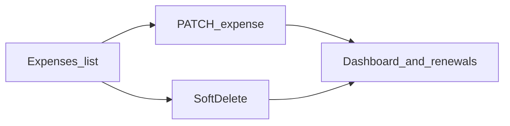
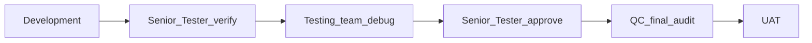

# RC5 — Finance expense edit & soft-delete

## Problem

Expenses support create + list only. Finance cannot correct team / amount / paid by / renewals or remove cancelled lines without DB work. `Expense.is_active` already exists; list, dashboard, and renewals should only use active rows.

## HOD lock (do not reopen in build)

| Decision | Lock |
|----------|------|
| **Edit** | In-panel edit via `PATCH /finance/expenses/{id}` (same fields as create). |
| **Delete** | **Soft-delete only**: `is_active=false`. No hard SQL delete. |
| **Confirm** | Delete requires confirm dialog: name · amount · team · paid by. |
| **Team** | `team_id` remains required on edit; cannot clear to null. |
| **Paid by** | On edit, if cost centre / team changes and `paid_by` not explicitly set, re-apply who-pays default; explicit override wins. |
| **Permissions** | Edit + Delete → finance module **EDIT**. Create stays **CREATE**. Non-finance → **403**. |
| **Audit** | Patch and soft-delete write Activity (`cost_updated` on `EntityType.expense` with clear `new_value`, or add `expense_updated` / `expense_deleted` if enums extended). |
| **Out of scope** | Restore UI for deleted rows; bulk delete; multi-team split; GL / invoice void. |

## Where to develop

### Backend

| Area | Files |
|------|--------|
| Schemas | [`app/schemas/finance.py`](./../app/schemas/finance.py) — add `ExpenseUpdate` |
| API | [`app/api/v1/finance.py`](./../app/api/v1/finance.py) — `PATCH` + `DELETE` (soft) |
| Defaults | Reuse [`paid_by_defaults.py`](./../app/services/finance/paid_by_defaults.py) |
| Rollups | Verify [`dashboard_service.py`](./../app/services/finance/dashboard_service.py) + [`renewal_notifier.py`](./../app/services/finance/renewal_notifier.py) already exclude `is_active=false` |

### Frontend

| Area | Files |
|------|--------|
| UI | [`FinanceExpensesPanel.tsx`](./../frontend/src/components/finance/FinanceExpensesPanel.tsx) — Edit / Delete per row |
| Confirm | [`ConfirmDialog.tsx`](./../frontend/src/components/common/ConfirmDialog.tsx) |
| Deploy | Rebuild `frontend/dist` for IIS |

### API shape (target)

- `PATCH /api/v1/finance/expenses/{expense_id}` — body: partial expense fields; require `team_id` when present; recompute FX base amount when amount/currency/date change; **404** if missing or inactive.
- `DELETE /api/v1/finance/expenses/{expense_id}` — soft-delete; **404** if missing or already inactive; response **204** or deactivated `ExpenseRead`.

## Click map

| What | Where |
|------|--------|
| Edit expense | `/finance` → **Expenses & subscriptions** → row **Edit** → form **Save changes** |
| Delete expense | Same list → **Delete** → confirm → soft-remove |

## Pipeline (mandatory)

1. **Development** — build against lock; deploy `app/` + `frontend/dist`; restart API.
2. **Senior Tester verify** — smoke matrix below; sign this checklist.
3. **Testing team** — debug / regression; log defects.
4. **Senior Tester approve** — blockers cleared.
5. **QC** — soft-delete not hard wipe; Overview + renewals consistent; permissions; docs match UI.
6. **UAT** — Head of Finance: correct a license line; delete a cancelled subscription; All / team filter totals update.

### Senior Tester / Testing matrix

- [ ] Create → Edit amount → Overview Prosohm opex / pass-through updates by `paid_by`
- [ ] Edit team A → team B (filter scopes correctly)
- [ ] Edit SW centre with customer-pays terms → default paid by unless override
- [ ] Delete → confirm; gone from list; Overview ↓; renewals ignore it
- [ ] Delete again / edit deleted → **404**
- [ ] Designer → **403** on PATCH/DELETE
- [ ] Rebuild 2 regression: team required on create; who-pays; Corporate expenses

### QC

- [ ] Soft-delete only (`is_active=false`); row still in DB
- [ ] No salary / expense leakage on Ops-only routes
- [ ] Docs match UI; deploy `app/` + `frontend/dist`

## Related

- [RC5_FINANCE_TEAM_SCOPE.md](./RC5_FINANCE_TEAM_SCOPE.md)
- [RC5_FINANCE_REBUILD.md](./RC5_FINANCE_REBUILD.md)
- [RC5_SALARY_ELIGIBILITY.md](./RC5_SALARY_ELIGIBILITY.md)
