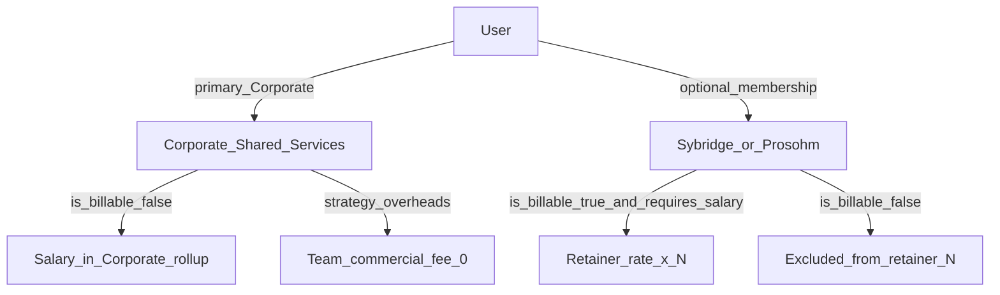

# RC5 — Management / overhead headcount vs customer-billable teams

## Problem (UAT)

Teams such as **Sybridge-LS** and **Prosohm Eng** currently treat all salary-required members as **billable headcount**. Managers and HQ people who only **oversee** work are not paid by the customer under fixed / retainer commercial models — yet today they still inflate:

- Retainer **rate × resources** on Team commercial / Overview  
- Team People-costs headcount when those managers are also attached to a delivery team  

**Corporate / Shared Services** already exists for HQ **expenses**, but people who are pure management overhead are not yet systematically counted as a **management team** (and excluded from customer-team fee math).

Screenshot context: Teams admin lists Prosohm Eng, Sybridge-Sale, Corporate / Shared Services — overhead people must land on the management / corporate side for commercial counting, not as “resources” of individual customer teams.

---

## HOD lock (do not reopen in build)

### 1 — Two commercial headcount classes

| Class | Meaning | Who |
|-------|---------|-----|
| **Delivery / billable** | Counted for customer retainer / fixed-model resource rate | Designers, dedicated delivery staff on a customer team |
| **Management / overhead** | Not paid by customers under retainer / fixed commercial models | Pure managers, HQ, shared leads who only manage |

### 2 — Where overhead people “belong”

| Decision | Lock |
|----------|------|
| Home team | Primary membership (or sole membership) on **`Corporate / Shared Services`** — product label in UI may show **Management / Overhead** as alias or description; **do not** invent a second Corporate team in v1. |
| Delivery teams | May keep a **secondary / lead** link for ops (timesheets visibility, notifications) **only if** relationship is non-billable — see §3. |
| Working model | Corporate team commercial strategy = **`overheads`** (fee = 0). Never attach retainer “rate × headcount” to Corporate. |

### 3 — Flag / membership rule (source of truth)

| Decision | Lock |
|----------|------|
| Field | `team_members.is_billable_headcount` **boolean**, default **`true`** for new memberships on delivery teams; default **`false`** when team is Corporate / Shared Services. |
| Alternate (same effect) | If implementing via user flag instead: `users.is_management_overhead` — **prefer membership flag** so the same person can be billable on one rare future split but overhead on Corporate. **v1 lock: membership flag.** |
| Retainer count (customer team) | Count only active members where `requires_salary=true` **AND** `is_billable_headcount=true` **AND** team is the commercial team. |
| Corporate salary rollup | Salary for overhead people rolls under **Corporate / Shared Services** (team filter / by_team). They do **not** add to Sybridge/Prosohm Eng **commercial fee** headcount even if also listed as Team Lead elsewhere. |
| Team Lead | Being Team Lead does **not** alone imply billable. Lead on Sybridge who is overhead must have `is_billable_headcount=false` on that membership (or only Corporate membership). |

### 4 — Customer commercial models

| Model | Lock |
|-------|------|
| **Retainer / Subscription** | `monthly_fee_signal = rate × billable_headcount` (salary-required ∩ billable). Overhead people excluded. |
| **Project Based (Fixed Fee) / T&M** | Still **no** team flat fee (existing). Overhead irrelevant to fee; salary still on Corporate if classified overhead. |
| **Overheads** (Corporate) | Customer fee always **0**. |

### 5 — Admin UX

| Surface | Behaviour |
|---------|-----------|
| Admin → **Teams** → edit membership | Per member: **Billable headcount** checkbox (visible; Corporate defaults off). |
| Admin → **Users** | Help text: “Managers paid from overhead (not customer retainer) should be on Corporate / Shared Services with Billable headcount off on customer teams.” |
| Finance → Team commercial (retainer) | Show **Billable resources: N** (not raw member count). Tooltip: excludes management overhead. |
| Finance → People costs | Team filter Corporate shows overhead salaries; delivery team filter excludes pure overhead if primary team is Corporate. |

### 6 — Out of scope (v1)

- Auto-infer overhead from job title.  
- Charging a separate “management fee” line to the customer.  
- Multi-company / org split beyond Corporate team.  
- Changing Annual Plan “Overhead” grid lines (keep independent).

---

## Current state (code today)

| Area | Today | Gap |
|------|--------|-----|
| Corporate team | Seeded [phase23](../app/db/phase23_finance_team_scope_schema_sync.py) for shared **expenses** | No billable-headcount distinction on members |
| Retainer math | [`_team_fee_monthly`](../app/services/finance/dashboard_service.py): rate × `requires_salary` members | Does **not** exclude managers / overhead |
| `requires_salary` | [RC5_SALARY_ELIGIBILITY.md](./RC5_SALARY_ELIGIBILITY.md) — exempts Admin/Planning Board from People costs | Orthogonal: Admin can be salary-exempt **or** salary-on-Corporate; does **not** alone solve “in Sybridge roster but not customer-paid” |
| Working model `overheads` | Exists; fee rules already force fee 0 | Corporate team must actually use this model in commercial terms |
| Teams UI | Edit/Delete exist (screenshot) | No Billable headcount on membership |

---

## Where to develop

### Backend

1. **Schema** — `phase28_team_member_billable_schema_sync.py` (or next free phase):  
   - `team_members.is_billable_headcount BOOLEAN NOT NULL DEFAULT 1`  
   - Backfill: `false` where `team_id` = Corporate / Shared Services; else `true`.  
2. **Models / schemas** — TeamMember create/update/read include flag; Teams membership APIs accept it.  
3. **Headcount helper** — shared function e.g. `billable_salary_headcount(db, team_id)` used by:  
   - `_team_fee_monthly` / Team commercial `resource_count`  
   - Any retainer display on `TeamCommercialTermsRead`  
4. **People costs / salary team filter** — when filtering a delivery team, exclude users whose **primary** team is Corporate and billable=false on that delivery membership (document exact rule in tests). Prefer: salary attributed by **primary team** (existing `User.team_id` / primary TeamMember); overhead people set primary = Corporate.  
5. **Seed** — ensure Corporate has Team commercial with working model **Overheads** (fee 0) if missing.  
6. **Tests** — see matrix.

### Frontend

1. **TeamsPage** (membership editor) — **Billable headcount** switch per member; Corporate defaults off.  
2. **FinanceTeamCommercialPanel** — “× N billable resources” (API-supplied `resource_count`).  
3. Copy on Corporate team description: “Management / overhead — not customer-paid headcount.”

### Docs / cross-links

- Update [RC5_FINANCE_EDITABLE_FEE_MODELS.md](./RC5_FINANCE_EDITABLE_FEE_MODELS.md) resource-count row to **billable ∩ requires_salary**.  
- Link from [RC5_FINANCE_TEAM_SCOPE.md](./RC5_FINANCE_TEAM_SCOPE.md) and [RC5_SALARY_ELIGIBILITY.md](./RC5_SALARY_ELIGIBILITY.md).

---

## Pipeline (mandatory)

1. **Development** — implement locks; API/UI/tests green; deploy `app/` + `frontend/dist`; restart API (phase28).  
2. **Senior Tester** — verify matrix; gate Testing.  
3. **Testing** — debug with real Sybridge manager cases; log repros.  
4. **Senior Tester** — re-approve.  
5. **QC** — docs ↔ UI ↔ retainer math; Corporate = overheads; no double-count salary+fee.  
6. **UAT** — Head of Finance: move pure managers to Corporate; confirm Sybridge retainer N drops; Corporate salaries visible; customer not charged for managers.

### Senior Tester / Testing matrix

- [ ] Delivery team member `is_billable_headcount=true` + `requires_salary` → included in retainer N  
- [ ] Same person `is_billable_headcount=false` on Sybridge → **excluded** from retainer N; Overview fee drops by 1 × rate  
- [ ] User primary on Corporate, salary on → Corporate People costs / Overview salary; **not** in Sybridge fee N  
- [ ] Corporate Team commercial = overheads → fee **0**  
- [ ] Project-based Prosohm Eng: still no flat fee; overheads unrelated to quotes  
- [ ] Admin membership UI shows Billable toggle; Corporate default off for new members  
- [ ] Designer 403 on finance write  
- [ ] Regression: expense purchase date FY; FX; team commercial edit; requires_salary exempt  

### QC audit

- [ ] Screenshot Teams + Team commercial + Overview match this doc  
- [ ] No customer retainer paid for management-only people  
- [ ] Deploy artifacts + API restart with phase sync  
- [ ] Related RC5 docs updated (fee models / team scope / salary)

---

## Pre-UAT ops note

Before UAT release candidate cut: **restart backend and frontend** after this package is merged and `frontend/dist` rebuilt, so phase sync and UI are live on the verification environment.

---

## Related

- Team scope / Corporate expenses: [RC5_FINANCE_TEAM_SCOPE.md](./RC5_FINANCE_TEAM_SCOPE.md)  
- Retainer rate × headcount: [RC5_FINANCE_EDITABLE_FEE_MODELS.md](./RC5_FINANCE_EDITABLE_FEE_MODELS.md)  
- Salary exempt vs billable: [RC5_SALARY_ELIGIBILITY.md](./RC5_SALARY_ELIGIBILITY.md)  
- Code: [`dashboard_service._team_fee_monthly`](../app/services/finance/dashboard_service.py), [`commercial_fee_rules.py`](../app/services/finance/commercial_fee_rules.py), [`TeamsPage`](../frontend/src/pages/admin/TeamsPage.tsx), [`TeamMember`](../app/models/models.py)
