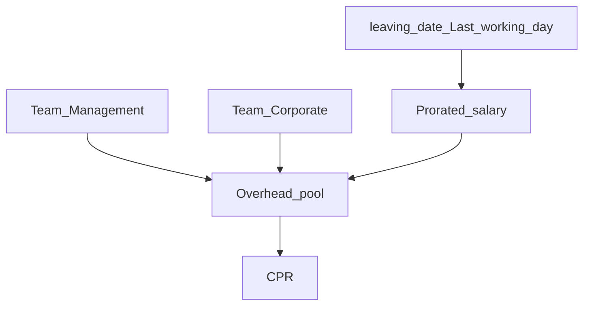

# RC5 — Last working day, Management team, overhead recurring costs

**Status:** Implemented — Management team seeded; leaving_date drives salary/headcount; Overheads recurring entry; Management salaries in overhead pool.

## Stakeholder brainstorm (Finance / CEO / Engineering)

| Seat | Industry lens | Locked outcome |
|------|---------------|----------------|
| **Head of Finance** | Accrual: salary & recurring OpEx recognized only while the person/contract is live. Mid-month leavers → calendar-day proration in that month only. | Use `users.leaving_date` as **Last working day**; prorate salary in leave month; exclude after |
| **CEO** | Clear Management bucket for leaders/admin — separate from delivery billable teams | New team **Management**; Design Leader / EM / OA / Admin (etc.) primary home here for overhead math |
| **Engineering Head** | Same billable N for CPR & retainer; leaders not in delivery N | Management team: `is_billable_headcount=false`; fee strategy **overheads** (fee 0) |

### P&L / absorption (unchanged spine + refinements)

```text
Revenue − Direct job cost = Gross
Overhead pool = Management salaries (prorated)
             + Corporate salaries (legacy HQ still there)
             + Management Prosohm OpEx + Corporate Prosohm OpEx
             (excl. ended expenses / customer pass-through)
CPR = Overhead pool ÷ delivery billable FTE (leaving-aware)
```

Annual Plan “Overhead” line remains an independent planning ledger.

### HOD locks

| Decision | Lock |
|----------|------|
| Last day field | Existing `users.leaving_date` — UI label **Last working day** |
| Salary after leave | Factor `0` from month *after* leaving; leave month = days employed ÷ days in month (also join-prorate) |
| Active run-rate | Employed through full month → full monthly salary (not days-elapsed-to-today) |
| Expenses up to date | OpEx with `end_date` before as-of excluded; recurring overheads set `end_date` when contract ends |
| Management team | Seed **Management**; commercial WM = overheads; default membership billable = false |
| Who belongs | Roles in `MANAGEMENT_OVERHEAD_ROLE_DEFAULTS` get primary membership on Management (phase33 backfill) |
| Corporate team | Remains for shared facilities OpEx; both Corporate + Management feed the overhead pool |
| Recurring overhead entry | Overheads tab form → creates Corporate or Management Prosohm OpEx with `is_recurring` |
| Out of scope | Auto-deactivate login on leave day (optional later); project overhead_allocation |



## Where to develop

| Layer | Path | Work |
|-------|------|------|
| Direction | `docs/RC5_FINANCE_MANAGEMENT_TEAM_LAST_DAY.md` | This doc |
| Phase | `app/db/phase33_management_team_schema_sync.py` | Seed Management + backfill |
| Fixed resource | `fixed_resource_eligibility.py` | Management team billable defaults |
| Helpers | `employment_cost.py` (new) | Salary factor / expense active |
| Dashboard | `dashboard_service.py` | Prorate salary; overhead teams; expense end_date |
| Headcount | `billable_headcount.py` | Exclude post-leave from N |
| Roster | `roster_service.py` + People costs UI | leaving_date display/edit |
| Overheads UI | `FinanceOverheadsPanel.tsx` | Recurring cost form |
| Users UI | `UsersPage.tsx` | Label Last working day |
| main/conftest | Register phase33 |

## Pipeline (mandatory)


### Senior Tester / Testing matrix

- [ ] Team **Management** exists; commercial fee 0  
- [ ] Design Leader / EM / OA primary on Management after seed (or can be moved)  
- [ ] Set Last working day → leave-month salary prorates; next month 0 in pool  
- [ ] Billable N drops after leave date  
- [ ] Overheads tab: add recurring cost on Management or Corporate  
- [ ] Ended expense (`end_date` past) drops from OpEx  
- [ ] CPR updates; Annual Plan Overhead line untouched  

### Pre-UAT ops

Restart **backend** and **frontend** after this package lands.

## Related

- [RC5_FINANCE_OVERHEADS_PNL.md](./RC5_FINANCE_OVERHEADS_PNL.md)  
- [RC5_FINANCE_MANAGEMENT_OVERHEAD.md](./RC5_FINANCE_MANAGEMENT_OVERHEAD.md)  
- [RC5_FINANCE_FIXED_RESOURCE_VS_OVERHEAD.md](./RC5_FINANCE_FIXED_RESOURCE_VS_OVERHEAD.md)
