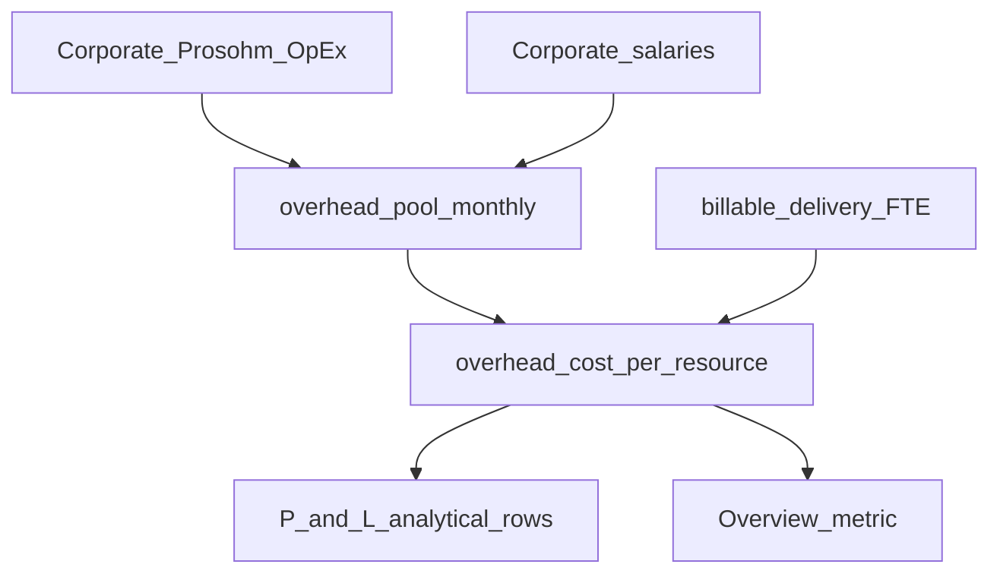

# RC5 — Overheads section + P&L cost-per-resource (brainstorm lock)

**Status:** Implemented — Finance → **Overheads** tab + dashboard CPR; Annual Plan “Overhead” grid stays independent.

## Stakeholder brainstorm (recorded HOD)

| Seat | Perspective | Outcome locked |
|------|-------------|----------------|
| **Head of Finance** | IFRS / services absorption: separate **direct** (project delivery labor + quoted job cost) from **indirect** (HQ OpEx + management salaries). Burden rate supports bid realism and true net margin. | Overheads pool = Corporate only; not delivery salaries |
| **CEO** | One clear CPR number for capacity decisions; no double-counting vs Annual Plan. | Show **Overhead cost / billable resource** on Overview + Overheads; keep Annual Plan grid as planning ledger |
| **Engineering Head** | Same **N** as retainer billable headcount (designers/surfacer ∩ billable ∩ salary-required) so fee and burden speak the same language | Denominator = unique billable salary users on **delivery** teams (exclude Corporate) |

### Industry standard (engineering services)

Typical build-up / P&L stack:

```text
Revenue (quotes + commercial fees)
− Direct / job cost (quoted estimated cost)
= Gross profit
− Overhead / indirect (management + HQ OpEx)
− Other operating (delivery salaries, tools if treated operating)
= Operating / net profit (local definition)
```

Common **burden / overhead rate**:

```text
overhead_cost_per_resource = monthly_overhead_pool ÷ billable_FTE
```

ProTrack v1 maps:

| Concept | ProTrack source |
|---------|-----------------|
| Overhead pool (monthly INR) | Corporate / Shared Services **Prosohm OpEx** (FY-gated) + Corporate **salaries** |
| Billable resources N | Unique users: delivery team ∩ `is_billable_headcount` ∩ `requires_salary` |
| CPR | `overhead_pool_monthly_inr / N` (0 when N=0) |
| Direct job cost | Existing quote `estimated_cost` (unchanged) |
| Operating cost (Overview) | Unchanged: scoped Prosohm OpEx + salaries for current team filter |
| Annual Plan “Overhead” line | **Independent** planning input — do not auto-overwrite from live pool this phase |

### HOD locks (do not reopen in build)

| Decision | Lock |
|----------|------|
| Where overhead lives | **Corporate / Shared Services** only — no second overhead team |
| Tab | New Finance tab **Overheads** (list + metrics); CRUD stays People costs / Expenses |
| P&L | Extend `profit-loss` report with Overhead pool + CPR rows from dashboard |
| Double-count | Do **not** subtract CPR again from net (net already uses operating cost); CPR is **analytical / rate build-up** |
| Pass-through customer OpEx | Excluded from overhead pool (not Prosohm burden) |
| CapEx | Out of monthly overhead pool (shown separately if needed) |
| Out of scope v1 | Auto-allocate CPR into `ProjectFinancialSnapshot.overhead_allocation`; inventing cost centres named “Overhead” |



## Where to develop

| Layer | Path | Work |
|-------|------|------|
| Direction | `docs/RC5_FINANCE_OVERHEADS_PNL.md` | Brainstorm + pipeline |
| Headcount | `app/services/finance/billable_headcount.py` | Company delivery billable unique count |
| Dashboard | `app/services/finance/dashboard_service.py` | `overhead_*` fields |
| Report | `app/api/v1/finance.py` `report_profit_loss` | Overhead + CPR rows |
| UI panel | `frontend/src/components/finance/FinanceOverheadsPanel.tsx` | New tab |
| Page | `FinanceDashboardPage.tsx` | Tab wire-up (shift Budgets index) |
| Overview | `FinanceOverviewPanel.tsx` | CPR / pool metrics |
| Tests | `tests/test_ebmp_finance.py` (or overhead-specific) | Pool ÷ N |

## Pipeline (mandatory)


1. **Development** — overhead metrics + Overheads tab; rebuild `frontend/dist`; restart API + frontend.  
2. **Senior Tester** — Corporate expenses + salaries appear; CPR = pool ÷ N; Overview shows CPR; P&L report lists Overhead + CPR.  
3. **Testing** — N=0 → CPR 0 / no crash; team filter Corporate vs delivery; pass-through OpEx not in pool.  
4. **Senior Tester** — re-approve.  
5. **QC** — Annual Plan Overhead line unchanged; no double-subtract of CPR in net profit; Corporate fee still 0.  
6. **UAT** — hard-refresh after restart.

### Senior Tester / Testing matrix

- [ ] Tab **Overheads** lists Corporate Prosohm OpEx rows (FY) and Corporate salary total  
- [ ] Metrics: pool, billable N, CPR  
- [ ] Overview shows overhead pool + CPR  
- [ ] Budgets & reports → P&L includes Overhead pool and CPR  
- [ ] Delivery salaries not in overhead pool  
- [ ] Customer-paid OpEx not in pool  

### Pre-UAT ops

Restart **backend** and **frontend** after this package lands.

## Related

- [RC5_FINANCE_MANAGEMENT_OVERHEAD.md](./RC5_FINANCE_MANAGEMENT_OVERHEAD.md)  
- [RC5_FINANCE_FIXED_RESOURCE_VS_OVERHEAD.md](./RC5_FINANCE_FIXED_RESOURCE_VS_OVERHEAD.md)  
- [RC5_FINANCE_REBUILD.md](./RC5_FINANCE_REBUILD.md)  
- [FINANCE_ANNUAL_PLAN.md](./FINANCE_ANNUAL_PLAN.md)
