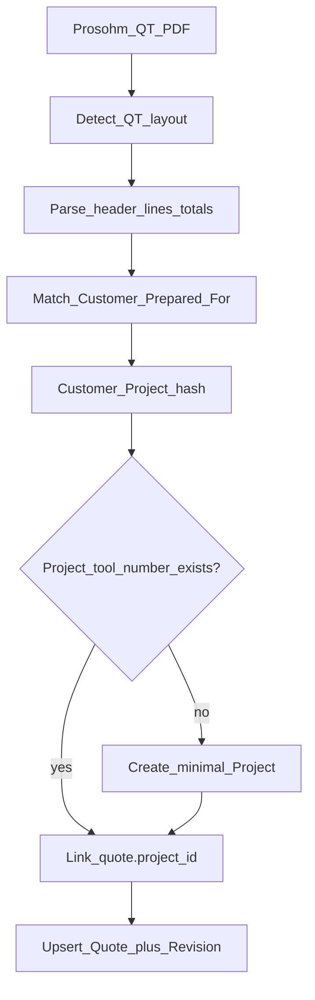

# RC5 — Prosohm awarded quote PDF (QT-*) extraction + project link/create

**Status:** Implemented (parser + create-project import + UI checkbox + phase30 `external_quote_number`). Pipeline: Dev complete → Senior Tester verify → Testing → ST approve → QC → UAT.

## Problem (UAT)

Sample award PDF (`QT-2026-27-001-SY#17974.pdf`) is a **Prosohm commercial quote layout**, not a spreadsheet with `Customer / Tool Number / Quoted Hours…` headers.

Current Finance **Revenue / quotes** PDF path (`extract_tables_as_dicts`) expects a generic table row and **fails / mis-parses** this format. Operators need to import real QT PDFs and optionally **match or create** the engineering project from **Customer Project #**.

Reference extract from the sample:

| Field on PDF | Sample value |
|--------------|--------------|
| Quote# | `QT-2026-27-001` |
| Quote Date | `10/04/2026` |
| Sales person | Anurag Mohanan |
| Customer Project # | `17974` |
| Prepared For | Sybridge Technologies Canada Inc-MIS (+ address) |
| Kind Attention | Mr.Girish Ayyar |
| Line | Full Tool Design (Export) — phases with hours |
| Qty/Hrs | `220.00` |
| Rate | `28.00` |
| Amount / Total | `$6,160.00` USD |
| Filename pattern | `QT-2026-27-001-SY#17974.pdf` → quote + customer proj |

Generic header-row import must remain for Excel/CSV packs; **Prosohm QT PDF** needs a dedicated parser.

---

## HOD lock (do not reopen in build)

### 1 — Document types

| Mode | When | Lock |
|------|------|------|
| **Prosohm QT PDF** | Filename matches `QT-` **or** page text contains `Quote#` + `Customer Project #` | Dedicated parser (this doc) |
| **Flat table** | Excel / CSV / generic PDF table with finance headers | Existing awarded-quote row import ([RC5_FINANCE_AWARDED_QUOTE_IMPORT.md](./RC5_FINANCE_AWARDED_QUOTE_IMPORT.md)) |

### 2 — Field mapping (Prosohm QT → Finance)

| PDF / source | ProTrack field | Notes |
|--------------|----------------|-------|
| `Customer Project #` | `quotes.tool_number` **and** prefer match to `projects.tool_number` | Primary engineering identity (e.g. `17974`) |
| `Quote#` | Store on quote (new `external_quote_number` **or** `notes` / revision notes in v1) | Keep QT-… for audit; do **not** replace tool_number |
| `Quote Date` | Revision `start_date` / FX date | Parse `dd/mm/yyyy` and `mm/dd/yyyy` carefully (sample is **10/04/2026** = 10 Apr in Prosohm Indian docs — **lock: DD/MM/YYYY first**) |
| `Prepared For` first line | Customer name match | Fuzzy: exact → contains → strip suffix after `-` (e.g. `…Inc-MIS`) |
| Currency | From `$` / “United States Dollar” / Amount column | Map to `USD` / `INR` / etc.; else customer default |
| Sum of line **Qty/Hrs** (or single line hours) | `quoted_hours` | Sample: **220** |
| Sum of line **Amount** / Total | `quoted_revenue` | Sample: **6160** |
| Estimated cost | Optional | If absent: `0` for v1 **or** leave blank and UI shows cost missing — **lock: store 0 estimated_cost** unless a Cost column exists later |
| Rate × hours check | Soft validation | Warn if `|hours × rate − amount| > 0.05` but still import |
| Line description + phase hours | New optional `quote_line_items` JSON / child table **or** revision `notes` text in v1 | **v1 lock:** concatenate into revision `notes`; structured lines in v1.1 |
| Sales person | Optional `estimator` match by name; else leave importer as estimator | |
| Import team | **Required** (existing) | Sybridge-Sale for SY awards, etc. |

### 3 — Project match / auto-create

| Decision | Lock |
|----------|------|
| Match order | 1) `projects.tool_number == Customer Project #` (active, not deleted) 2) else optional name contains 3) else **create** |
| Auto-create | **Yes** when no match — create Project with `tool_number` = Customer Project #, `customer_id` = resolved customer, `team_id` = import team, `quoted_hours` from quote, name = `"{tool_number} — {quote short desc}"` or customer + tool |
| Link | Set `quotes.project_id` on create/revise |
| Existing project | Update link only; **do not** overwrite project quoted_hours unless empty/`0` — **lock: if project.quoted_hours is 0/null, set from quote; else leave and store quote hours on revision only** |
| Permissions | Finance CREATE may create this minimal project; use existing project create service with finance audit note `created_from_quote_import` |
| Fail if customer missing | **400** with clear message — do **not** auto-create customers (same as awarded import lock) |

### 4 — UX

| What | Where |
|------|--------|
| Upload | Revenue / quotes — keep team required |
| Copy | “Supports Prosohm QT PDFs (Quote# / Customer Project #) and Excel/CSV packs.” |
| Result card | Quote# · Customer Project # · customer · team · hours · revenue · Linked / Created project |
| Options (checkbox) | **Create project if missing** (default **on**); if off → Unlinked allowed |
| Errors | Exact detail (customer not found, parse failed, FX missing) |

### 5 — Out of scope (v1)

- OCR for scanned image-only PDFs (this sample is text-extractable).  
- Multi-currency line mixes on one PDF.  
- PO / advance terms as finance postings.  
- Replacing Excel pack importer.

---

## Where to develop

### Backend

1. **`app/services/finance/prosohm_quote_pdf_parser.py`** (new)  
   - Detect QT layout; regex/helpers for Quote#, Quote Date, Customer Project #, Prepared For block, Kind Attention, Total / currency, line Qty/Hrs / Rate / Amount.  
   - Return normalized dict compatible with `import_quote_row` (+ extras: `external_quote_number`, `line_notes`, `create_project`).  
2. **`quote_import_service.import_quotes_from_pdf`**  
   - If QT detected → parser path (one quote per PDF typical); else existing table path.  
3. **Project ensure** — helper `ensure_project_for_quote_import(db, *, tool_number, customer_id, team_id, quoted_hours, name_hint, actor)`.  
4. **Schema (optional phase30)**  
   - `quotes.external_quote_number` VARCHAR nullable.  
   - Prefer this over stuffing QT# into tool_number.  
5. **Filename hint** — if text parse weak, filename `QT-…-SY#17974` can confirm project # (`#(\d+)$` / `SY#(\d+)`).  
6. **Tests** — fixture bytes or golden extract from sample fields; assert hours=220, revenue=6160, currency=USD, tool=17974, customer match, project created once then linked.

### Frontend

- `FinanceQuotesPanel` copy + result fields for quote# / created project.  
- Checkbox **Create project if missing** → Form field on import.  
- Toast shows API detail via `apiErrorMessage`.

### Sample packaging for Testing

- Keep a **redacted copy** under `tests/fixtures/quotes/QT-2026-27-001-sample.pdf` (or mock text equivalent) — do **not** commit OneDrive originals with customer PII if policy forbids; synthetic PDF with same labels is enough.

---

## Pipeline (mandatory)

1. **Development** — locks above; unit + import tests; deploy `app/` + `frontend/dist`; restart API.  
2. **Senior Tester** — import sample QT PDF for Sybridge-Sale; verify numbers and project.  
3. **Testing** — debug customer-name variants, date parse, FX USD.  
4. **Senior Tester** — re-approve.  
5. **QC** — mapping table matches PDF; no false Excel-path regression; project create auditable.  
6. **UAT** — Finance imports Quotes 26-27 folder; projects appear under correct team/customer.

### Senior Tester / Testing matrix

- [ ] Import `QT-2026-27-001-…#17974.pdf` with team Sybridge-Sale → hours **220**, revenue **6160**, currency **USD**, tool **17974**  
- [ ] Customer resolves to Sybridge… (seeded/admin customer name must match or soft-match)  
- [ ] First import creates project `17974` when missing; second import **links** same project (no duplicate)  
- [ ] Checkbox off → quote imports Unlinked, no project create  
- [ ] Excel/CSV pack path unchanged  
- [ ] Generic non-QT PDF table still works  
- [ ] Wrong customer name → clear 400  
- [ ] Missing USD FX on quote date → FX error (phase27 seed covers FY start)  
- [ ] Team required  
- [ ] Designer 403  

### QC audit

- [ ] Docs + UI copy list Prosohm QT fields  
- [ ] `Customer Project #` ≠ mis-stored as Quote#  
- [ ] DD/MM/YYYY date lock respected for Quote Date  
- [ ] Deploy + restart before UAT cut  

---

## Pre-UAT ops

Restart **backend** and **frontend** after this package lands so phase sync + Vite pick up QT parser before UAV/UAT.

---

## Related

- Team-scoped awarded import: [RC5_FINANCE_AWARDED_QUOTE_IMPORT.md](./RC5_FINANCE_AWARDED_QUOTE_IMPORT.md)  
- Customer currency + FX: [RC5_FINANCE_CUSTOMER_CURRENCY_FX.md](./RC5_FINANCE_CUSTOMER_CURRENCY_FX.md)  
- Code today: [`pdf_table_import.py`](../app/services/pdf_table_import.py), [`quote_import_service.py`](../app/services/finance/quote_import_service.py), [`FinanceQuotesPanel.tsx`](../frontend/src/components/finance/FinanceQuotesPanel.tsx)
