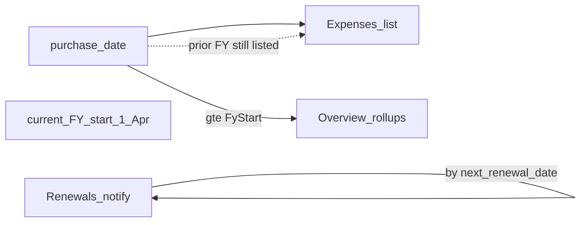

# RC5 — Expense purchase date & FY cutover for rollups

## Problem

Hardware, software, and other purchases need a **date of purchase**. Financial Planning should count costs **from the current fiscal year onwards**. Items bought in a prior FY stay on record but must **not** inflate this year’s Overview / operating cost / pass-through totals.

Annual Plan already uses **Apr–Mar** FY ([`annual_plan_service.fiscal_year_bounds`](../app/services/finance/annual_plan_service.py)). Expense has optional `start_date` but no purchase-date semantics or FY filter on rollups.

## HOD lock (do not reopen in build)

| Decision | Lock |
|----------|------|
| **FY calendar** | **Indian FY**: 1 Apr → 31 Mar (same as Annual Plan). Current FY start = most recent 1 Apr on or before today. |
| **Field** | `expenses.purchase_date` (`DATE`, required on create/edit from this change). Distinct from subscription `start_date` / `next_renewal_date`. |
| **UI label** | **Date of purchase** on Expenses & subscriptions (software, hardware, cloud, rent, etc. — all expense lines). |
| **Overview rollups** | Sum only active expenses where `purchase_date >= current_FY_start`. Prior FY lines → **excluded** from Prosohm opex, pass-through, and CAPEX totals. |
| **List** | Default list still shows all active expenses (team-scoped). Prior FY rows show badge **Prior FY — not in Overview**. Optional filter: **Current FY only**. |
| **Renewals** | Renewal notify / upcoming strip still include active recurring by `next_renewal_date` **even if** purchase was prior FY (operations care about renewals; planning opex does not re-count sunk purchase). |
| **Backfill** | Existing rows: if `purchase_date` null, set from `start_date` else `fx_date` else created date (date part). Rows before current FY start stay excluded from Overview until user edits purchase_date into current FY (explicit rebook). |
| **Out of scope** | Depreciation schedule; multi-year CAPEX amortization; changing Annual Plan grids; auto-importing fixed-asset register. |

## Where to develop

### 1. Schema / sync — `phase25_expense_purchase_date_schema_sync.py`

- Add `purchase_date DATE` (nullable briefly for migrate, then backfill, then API requires it).
- Backfill: `purchase_date = COALESCE(start_date, fx_date, DATE(created_at))`.
- Hook in [`app/main.py`](../app/main.py) + [`tests/conftest.py`](../tests/conftest.py).
- Model: [`Expense.purchase_date`](../app/models/finance.py).

### 2. FY helper

- Reuse or thin-wrap `fiscal_year_bounds` / add `current_fy_start(today) -> date` in finance services (month=4).

### 3. API / schemas

- [`ExpenseCreate`](../app/schemas/finance.py) / Update / Read: `purchase_date: date` required on write.
- List query: optional `current_fy_only=true`.
- Dashboard expense sums: filter `purchase_date >= current_fy_start` (and `is_active`).
- Create/PATCH: reject missing `purchase_date` (400/422).

### 4. Frontend — [`FinanceExpensesPanel.tsx`](../frontend/src/components/finance/FinanceExpensesPanel.tsx)

- Required **Date of purchase** field.
- List: show purchase date; **Prior FY** chip when before FY start.
- Checkbox **Current FY only** (default off for visibility of historical inventory; Overview always FY-filtered).
- Wire into edit flow when expense CRUD lands ([RC5_FINANCE_EXPENSE_CRUD.md](./RC5_FINANCE_EXPENSE_CRUD.md)).

### 5. Overview

- [`FinanceOverviewPanel`](../frontend/src/components/finance/FinanceOverviewPanel.tsx) / dashboard payload: optional note `planning_fy_label` (e.g. `FY 2026-27`) and that opex is current-FY purchases only.

### 6. Docs & tests

- This gate doc + link from team-scope / expense CRUD docs.
- Tests: prior-FY Prosohm expense does **not** increase Overview opex; current-FY does; list still returns prior with badge data; create without purchase_date rejected; renewals still fire for prior-FY recurring with upcoming renewal.

## Pipeline (mandatory)

1. **Development** — lock above; deploy `app/` + `frontend/dist`; restart API (phase25).
2. **Senior Tester verify** — matrix; sign checklist.
3. **Testing team** — debug / regression.
4. **Senior Tester approve** — blockers cleared.
5. **QC** — FY Apr–Mar matches Annual Plan; prior FY not in Overview; list vs rollup consistency; docs match UI.
6. **UAT** — Head of Finance: log last-FY hardware (visible, excluded); this-FY software (counted); renewals still alert for old subscription.

### Senior Tester / Testing matrix

- [ ] Create expense with purchase_date in prior FY → list shows Prior FY chip; Overview opex/pass-through **unchanged**
- [ ] Create expense with purchase_date in current FY → Overview increases by paid_by rules
- [ ] Create without purchase_date → **400/422**
- [ ] Recurring prior-FY license with renewal in 5 days → still in upcoming renewals / notify
- [ ] Team filter + purchase_date both apply
- [ ] Designer 403
- [ ] Rebuild 2 / salary-eligibility regressions

### Explicit non-goals

Moving prior FY spend into Annual Plan automatically; cash-flow by purchase month beyond Overview exclusion; editing Finance Settings FY month (fixed Apr unless later HOD reopen).

## Related

- [RC5_FINANCE_TEAM_SCOPE.md](./RC5_FINANCE_TEAM_SCOPE.md)
- [RC5_FINANCE_EXPENSE_CRUD.md](./RC5_FINANCE_EXPENSE_CRUD.md)
- [RC5_FINANCE_REBUILD.md](./RC5_FINANCE_REBUILD.md)
