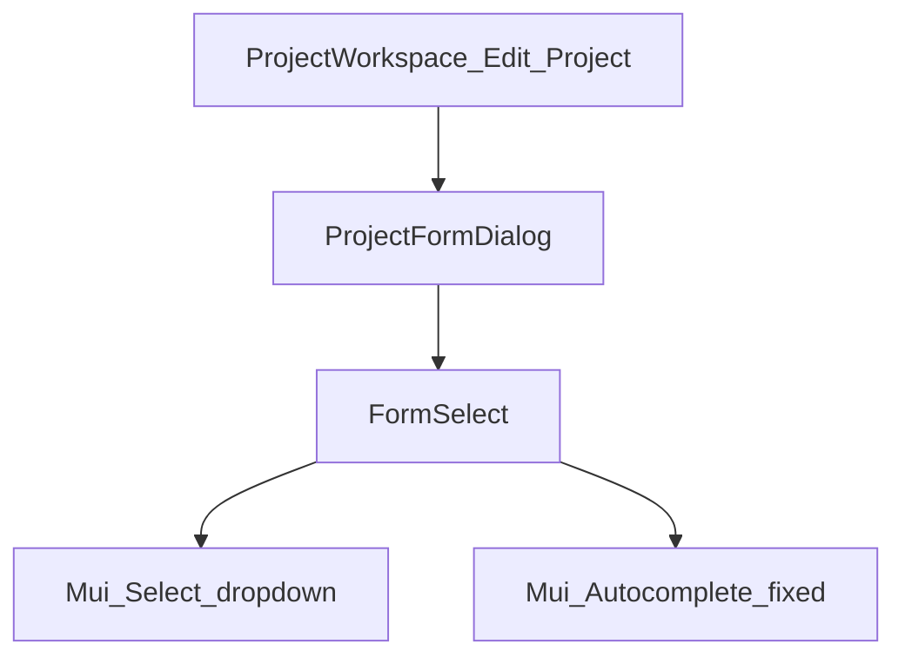
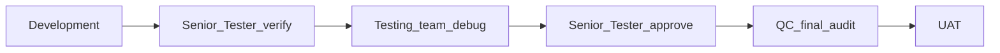

# RC5 — Edit Project form: empty Customer/Team selects (no dropdown UI)

**Status:** Implemented — FormSelect Autocomplete fixed; Edit Project Customer/Team use native Select dropdowns again.

## Problem (UAT)

On **Edit Project** (workspace, e.g. 3175 Tow Hitch Cover):

- Customer / Contact / Design Leader / Designer / Surfacer / Team show as **empty white fields**
- Header still shows customer **B & B Tool & Mould Ltd.** (data exists)
- Those fields have **no dropdown caret**; Stream (plain Select) still shows a caret

## Root cause

[`FormSelect.tsx`](../frontend/src/components/ui/design-system/FormSelect.tsx) `searchable` Autocomplete replaced `TextField` `slotProps` wholesale after `{...params}`, wiping Autocomplete’s input wiring → blank box, no popup icon.

Secondary: hydrate must keep assignment IDs from command-center `project`; orphan options use `*_name` from `ProjectRead` when lookups lag.

## HOD locks

| Decision | Lock |
|----------|------|
| Edit Project Customer/Team/Leader fields | Use **native Select** (dropdown caret), same pattern as Stream — not Autocomplete — until Autocomplete is proven stable |
| FormSelect Autocomplete | Fix by **merging** `params` into TextField; never drop Autocomplete slot wiring |
| Data | Never blank existing `customer_id` / assignment IDs on open; inject current names into options |
| Save | Block Save if Customer empty on edit |
| Out of scope | Redesigning Create Project flow fields beyond shared FormSelect fix |

## Where to develop

| Layer | Path | Work |
|-------|------|------|
| Direction | `docs/RC5_PROJECT_EDIT_FORM_SELECTS.md` | Pipeline + matrix |
| FormSelect | `frontend/src/components/ui/design-system/FormSelect.tsx` | Merge Autocomplete `params`; restore popup icon |
| Edit form | `frontend/src/components/projects/ProjectFormDialog.tsx` | Customer/Team sections: `searchable={false}`; hydrate + orphan options |
| Workspace | `ProjectWorkspace.tsx` | Pass full command-center `project` (unchanged) |
| Types | `Project` / command center | Verify IDs present on `ProjectRead` |

## Pipeline (mandatory)

1. **Development** — fix FormSelect + Edit Project selects; rebuild `frontend/dist`; restart API + frontend.  
2. **Senior Tester** — open 3175 Edit Project; Customer = B & B…; Leaders/Team/Stream show values + **dropdown carets**.  
3. **Testing** — Create Project still works; change customer then save; Design Leader options open.  
4. **Senior Tester** — re-approve.  
5. **QC** — no wipe of assignments on Save when fields look empty; Autocomplete consumers (filters) still OK.  
6. **UAT** — hard-refresh / publish dist; restart before cut.

### Senior Tester / Testing matrix

- [ ] Edit Project: Customer shows **B & B Tool & Mould Ltd.** (or correct customer) with caret  
- [ ] Design Leader / Designer / Surfacer / Team show values or None with caret  
- [ ] Stream dropdown still works  
- [ ] Opening dropdown lists customers / users / teams  
- [ ] Save does not clear customer if visible  
- [ ] Create Project still creates with Customer + Team  

### Pre-UAT ops

Restart **backend** and **frontend** after this package lands.
