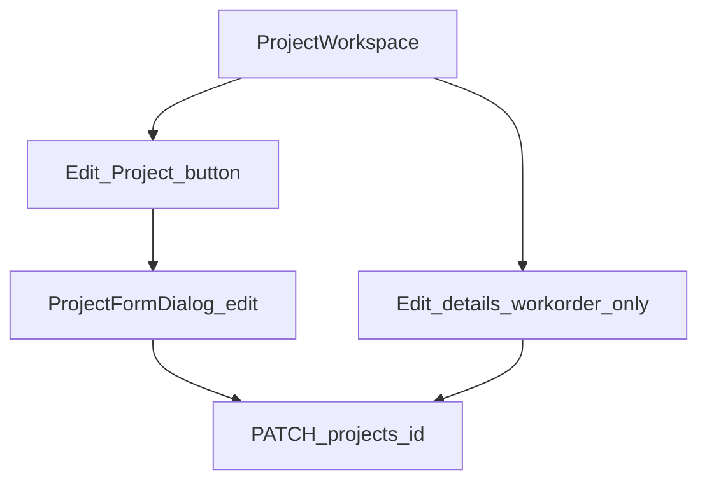
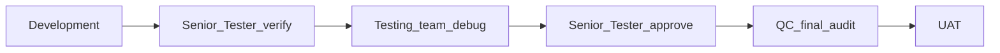

# RC5 — Full Project Edit from workspace (Create-parity drawer)

**Status:** Implemented — `Edit Project` on workspace opens `ProjectFormDialog` (edit mode). Workorder **Edit details** unchanged.

## Problem (UAT)

On the live project workspace (`/projects/:id`, e.g. **3175 — Tow Hitch Cover**), operators only see **Edit details** under Workorder / tooling. That panel updates tooling fields only.

The **full project edit** drawer (same as Create Project: customer, stream, team, design leader, designer, due date, stage/status/health, quoted hours, etc.) still exists but is reachable mainly from the **Projects list** row Edit / record drawer — **not** from the workspace header/Overview. Users opening a project from the list cannot update customer / stream without going back.

## HOD lock (do not reopen in build)

| Decision | Lock |
|----------|------|
| UI | Reuse existing **`ProjectFormDialog`** in **edit** mode — do **not** rebuild a new form or revive orphaned `ProjectDetailPage`. |
| Entry points | Workspace: sticky / back-row **Edit Project** button (visible when user may edit). Keep list Edit + record drawer Edit. |
| Workorder panel | Keep **Edit details** as the light tooling-only editor (and Import workorder). |
| Fields | Same as today’s edit-mode `ProjectFormDialog`: customer, contact, stream, team, design leader / designer / surfacer, schedule, priority/complexity, stage/status/health, working model, workorder, notes. Project Type remains create-primary (template change via existing Change Template). |
| API | Existing `PATCH /api/v1/projects/{id}` + `ProjectUpdate` — no new endpoint. |
| Permissions | Gate button with `canEditProject`. Backend `can_update_project` remains authoritative (403). Do **not** loosen backend in this package unless HOD opens a separate permission RC. |
| Out of scope | Changing milestone grid permissions; multi-customer; new Project Type picker on edit. |

## Where to develop

| Layer | Path | Work |
|-------|------|------|
| Direction (this) | `docs/RC5_PROJECT_WORKSPACE_FULL_EDIT.md` | Pipeline + matrix |
| Workspace | `frontend/src/components/projects/workspace/ProjectWorkspace.tsx` | Mount dialog; **Edit Project** next to Back / header; invalidate command-center query on save |
| Dialog (reuse) | `frontend/src/components/projects/ProjectFormDialog.tsx` | No structural rewrite — already supports `project` prop |
| List (unchanged) | `frontend/src/pages/ProjectsPage.tsx` | Keep existing Edit |
| Types / API | `projectService.updateProject`, `ProjectUpdate` | Already sufficient |
| Backend | `app/api/v1/projects.py` `update_project`, `app/schemas/project.py` | Verify only; no schema change expected |
| Permissions | `canEditProject` in `frontend/src/utils/permissions.ts`; `can_update_project` in `app/core/permissions.py` | Wire UI gate; document FE/BE nuance in QC |

Optional polish: `StickyRecordHeader` `actions` slot — **not required** if the button sits beside BackButton.

## Pipeline (mandatory)

1. **Development** — wire dialog; tests/smoke; rebuild `frontend/dist`; restart API + frontend.  
2. **Senior Tester** — open 3175 (or any active project); Edit Project; change stream + customer; save; header updates.  
3. **Testing** — debug permissions (Designer assigned vs not); Design Leader assigned-only; Admin free edit.  
4. **Senior Tester** — re-approve.  
5. **QC** — Create parity fields; workorder Edit details still separate; no orphan ProjectDetailPage routing.  
6. **UAT** — operators edit customer/stream from workspace without returning to list.

### Senior Tester / Testing matrix

- [ ] Workspace Overview shows **Edit Project** for Admin / EM  
- [ ] Drawer title **Edit Project**; Customer + Stream + Team + Design Leader editable  
- [ ] Save refreshes workspace header (customer name, quoted hours, etc.)  
- [ ] Workorder **Edit details** still only tooling fields  
- [ ] Projects list Edit still works  
- [ ] User without update rights: button hidden **or** API 403 with clear toast  
- [ ] Design Leader can edit only projects they lead (backend)  
- [ ] Regression: Create Project drawer unchanged; milestones / timesheets tabs OK  

### QC audit

- [ ] Docs ↔ UI: “Edit Project” vs “Edit details” wording distinct  
- [ ] Deploy `frontend/dist` (+ `app/` if any); restart before UAT  

### Pre-UAT ops

Restart **backend** and **frontend** after this package lands so Vite/`dist` serve the workspace Edit control.

## Related

- Workorder panel: [RC5_PROJECT_WORKORDER_DETAILS.md](./RC5_PROJECT_WORKORDER_DETAILS.md)  
- Form selects readability: [RC5_PROJECTS_READABILITY_AND_FORM_SELECTS.md](./RC5_PROJECTS_READABILITY_AND_FORM_SELECTS.md)  
