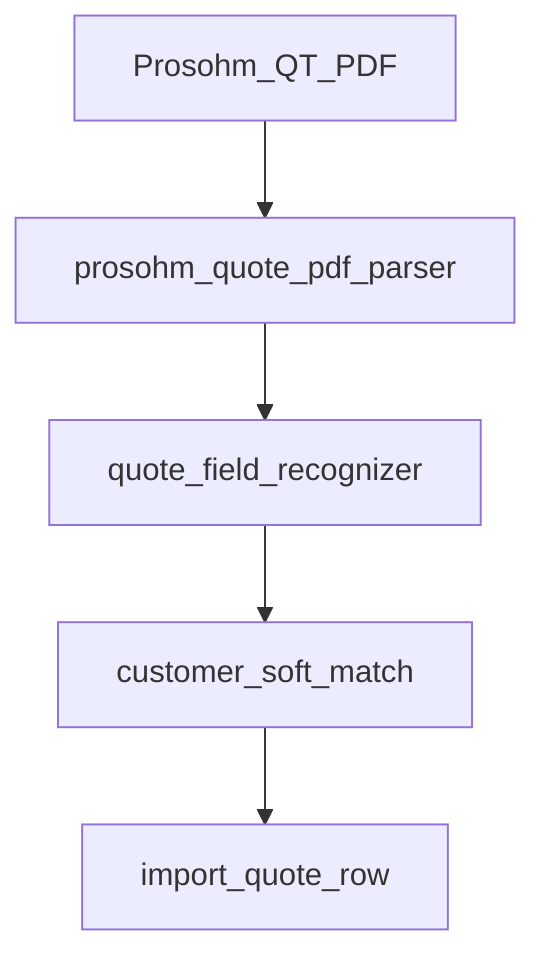
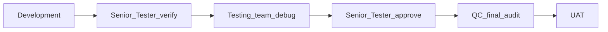

# RC5 — Prosohm QT quote AI: Customer + Project # + Cost (amount)

**Status:** Implemented — parser + soft-match trained on QT layouts like Crest Mold QT-2026-27-005.

## Problem (UAT)

Operators circled the only fields that matter on awarded QT PDFs:

| Label on PDF | Example (QT-2026-27-005) | ProTrack import field |
|--------------|--------------------------|------------------------|
| **Prepared For** (first name line) | Crest Mold | `customer` → match Customer master |
| **Customer Project #** | 2649 | `tool_number` |
| **Total** ($ amount) | $5,250.00 | `quoted_revenue` (quoted amount / “cost” for planning) |

Hours/rate remain supporting fields when present; AI must not invent customer from address lines, and must soft-match short names (`Crest Mold`) to seeded customers (`Crest Mold Technologies (CMT)`).

## HOD locks

| Decision | Lock |
|----------|------|
| Fields of truth | Customer, Customer Project #, Total amount (USD/INR as printed) |
| UI label “cost” | Maps to **quoted_revenue** on Quote — not People Costs / hourly |
| Customer create | Still **no auto-create** customer; soft-match directory only |
| Project | Keep `create_project` checkbox; tool # must equal Customer Project # |
| AI | Heuristic + directory scoring first; module `quote_import_field_recognizer` stays the hook |

## Where to develop

| Layer | Path | Work |
|-------|------|------|
| Direction | `docs/RC5_QUOTE_AI_CUSTOMER_PROJECT_COST.md` | This doc |
| QT parser | `app/services/finance/prosohm_quote_pdf_parser.py` | Prepared For = first non-address line; Total `$` as amount; Project # |
| Soft match | `app/services/finance/quote_import_service.py` `_find_customer` | Prefix / token match for short Prepared For names |
| Recognizer | `app/services/finance/quote_field_recognizer.py` | Synonyms: cost→quoted_revenue, project #→tool_number |
| Tests | `tests/test_prosohm_quote_pdf_import.py` | Golden **Crest Mold** QT-2026-27-005 text |
| UI copy | `FinanceQuotesPanel.tsx` | Remind: Customer / Project # / Total |

## Pipeline (mandatory)

1. **Development** — train parser + soft-match; golden test; rebuild `frontend/dist`; restart API + frontend.  
2. **Senior Tester** — upload `QT-2026-27-005` (or equivalent); confirm customer Crest Mold*, tool 2649, amount 5250 USD.  
3. **Testing** — debug soft-match only / address-line false customers / missing Total.  
4. **Senior Tester** — re-approve.  
5. **QC** — matrix below; Sybridge QT golden still green.  
6. **UAT** — restart before cut; hard-refresh Finance → Revenue / quotes.

### Senior Tester / Testing matrix

- [ ] Prepared For **Crest Mold** (not street address) becomes customer soft-match  
- [ ] Customer Project # **2649** → tool_number / project link  
- [ ] Total **$5,250.00** → quoted_revenue (not hours alone)  
- [ ] Quote# QT-2026-27-005 stored when present  
- [ ] Customer must exist in ProTrack (soft-match OK)  
- [ ] Regression: Sybridge QT-2026-27-001 sample still imports  

### Pre-UAT ops

Restart **backend** and **frontend** after this package lands so Vite/`dist` and parser code are live.

## Related

- [RC5_FINANCE_PROSOHM_QT_PDF.md](./RC5_FINANCE_PROSOHM_QT_PDF.md)  
- [RC5_FINANCE_QUARTERLY_SKILL_FEES_AND_QUOTE_AI.md](./RC5_FINANCE_QUARTERLY_SKILL_FEES_AND_QUOTE_AI.md)  
