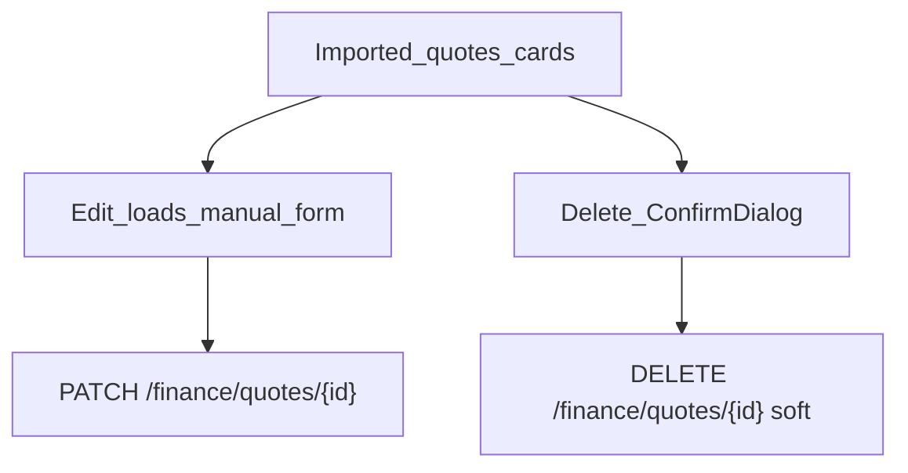
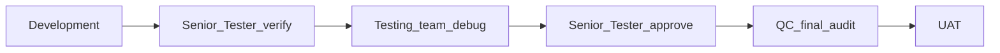

# RC5 — Awarded quotes: Edit / Delete (expenses parity)

**Status:** Implemented — list cards get Edit + Delete like Expenses; soft-delete; in-place update of current revision amounts.

## Problem (UAT)

Awarded quotes appear in **Imported quotes** but have **no Edit / Delete** actions. Operators cannot correct Quote # / Project # / Cost after save, or remove bad rows — Expenses already support this pattern.

## HOD locks

| Decision | Lock |
|----------|------|
| UX parity | Same card actions as Expenses: **Edit** (loads form) + **Delete** (confirm dialog) |
| Delete | **Soft-delete** `quotes.is_active = false` (drops from list + Overview rollups that filter active) |
| Edit | Updates quote header + **current** revision amounts in place (not forced new revision) |
| Editable fields | Customer, Team, Quote #, Project #, Cost, Currency (same manual form) |
| Project re-link | On Project # change, re-match `projects.tool_number`; optional **Create project if missing** applies on Save while editing |
| Permissions | Edit/Delete require Financial Planning **edit** action (same as expense update/delete) |
| Out of scope | Multi-revision browser UI; hard purge; AI re-parse on edit |

## Where to develop

| Layer | Path | Work |
|-------|------|------|
| Direction | `docs/RC5_QUOTE_EDIT_DELETE.md` | This doc |
| Schema | `app/schemas/finance.py` | `QuoteUpdate`; enrich `QuoteRead` with current amounts |
| Service | `app/services/finance/quote_import_service.py` | `update_quote` / soft-delete helper |
| API | `app/api/v1/finance.py` | `PATCH` + `DELETE /finance/quotes/{id}` |
| UI | `frontend/src/components/finance/FinanceQuotesPanel.tsx` | Card Edit/Delete + form edit mode + ConfirmDialog |
| Tests | `tests/test_quote_manual_entry.py` | Update + soft-delete smoke |

## Pipeline (mandatory)

1. **Development** — API + UI parity with expenses; rebuild `frontend/dist`; restart API + frontend.  
2. **Senior Tester** — Edit a listed quote (cost / Quote #); Delete one; confirm gone from list; Overview team filter updates.  
3. **Testing** — edit Project # re-link; delete then list filter; permission 403 for non-finance roles.  
4. **Senior Tester** — re-approve.  
5. **QC** — soft-delete does not break FK revisions; Save cancel exits edit mode; no wipe of other quotes.  
6. **UAT** — hard-refresh after restart.

### Senior Tester / Testing matrix

- [ ] Each imported quote card shows **Edit** and **Delete**  
- [ ] Edit loads Customer / Quote # / Project # / Cost / Currency into form; Save changes updates card  
- [ ] Cancel exits edit mode without saving  
- [ ] Delete confirm removes quote from list (soft)  
- [ ] Overview / planning revenue no longer includes deleted quote  
- [ ] Team filter still lists remaining quotes  

### Pre-UAT ops

Restart **backend** and **frontend** after this package lands.
