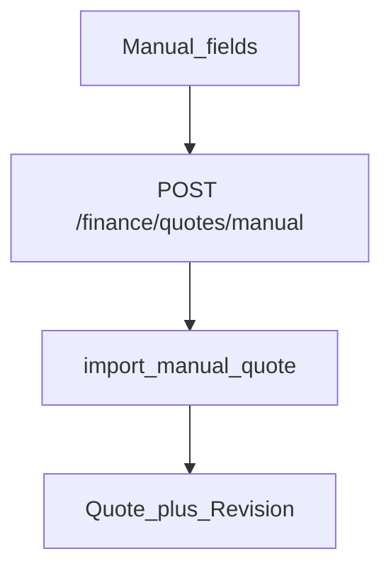
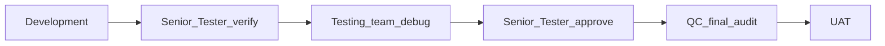

# RC5 — Awarded quote: manual Quote # / Project # / Cost

**Status:** Implemented — typed entry is the UAT path; smart PDF AI deferred this phase.

## Problem (UAT)

Smart Prosohm QT recognition (Prepared For / Project # / Total) is still unreliable in operator UAT. Finance must land awarded quote revenue without waiting on parser fixes.

## HOD locks

| Decision | Lock |
|----------|------|
| Primary path this phase | **Manual typing**: Quote #, Project #, Cost |
| Customer / Team | Required selects (no auto-create customer) |
| Cost | Maps to `quoted_revenue` (quoted amount / Total) |
| Project # | Maps to `tool_number` (Customer Project #); create-project checkbox unchanged |
| Quote # | Optional; maps to `external_quote_number` |
| Smart PDF / Excel upload | Optional secondary only; not blocked, not required for UAT |
| Out of scope this slice | Retraining AI recognizer until ST signs off manual path |

## Where to develop

| Layer | Path | Work |
|-------|------|------|
| Direction | `docs/RC5_QUOTE_MANUAL_ENTRY.md` | This doc |
| Schema | `app/schemas/finance.py` | `QuoteManualCreate` |
| Service | `app/services/finance/quote_import_service.py` | `import_manual_quote` |
| API | `app/api/v1/finance.py` | `POST /finance/quotes/manual` |
| UI | `frontend/src/components/finance/FinanceQuotesPanel.tsx` | Typed fields + Save quote |

## Pipeline (mandatory)

1. **Development** — manual endpoint + UI; rebuild `frontend/dist`; restart API + frontend.  
2. **Senior Tester** — Finance → Revenue / quotes: type Quote #, Project #, Cost; Save; list shows values.  
3. **Testing** — duplicate revision error; missing FX for currency; create project on/off.  
4. **Senior Tester** — re-approve.  
5. **QC** — Overview team filter picks up revenue; no wipe of other quotes.  
6. **UAT** — hard-refresh after restart.

### Senior Tester / Testing matrix

- [ ] Save with Customer + Team + Project # + Cost (Quote # optional)  
- [ ] List shows Quote # · Project # and amount  
- [ ] Create project if missing links / creates tool  
- [ ] Invalid / blank Project # or Cost blocked with clear toast  
- [ ] File upload still optional, not required  

### Pre-UAT ops

Restart **backend** and **frontend** after this package lands.
